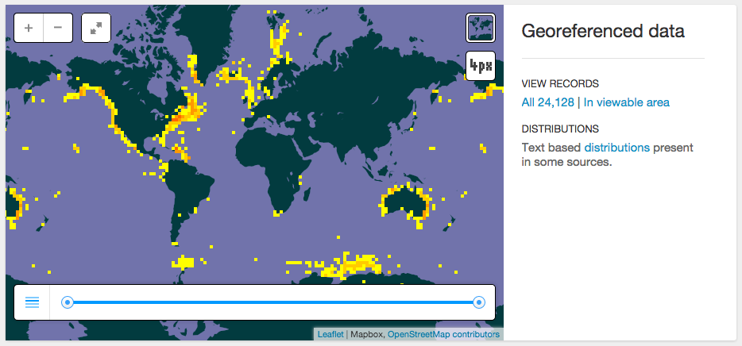

# Final Project

For the final project, you can:

1. Pick a Species

1. Pick an Ecosystem Service

## Species

If you choose a species, please visit [gbif.org](http://www.gbif.org) to confirm observation data are available and capture a screenshot of the map.

For example, humpback whale (_Megaptera novaeangliae_):



## Ecosystem Service

If you choose ecosystem service, please coordinate with Lisa as to which service and place to use.

## Submit Proposal as project/README.md

Submit your proposal to `H:\esm296-4f\github\lab2\README.md`. Be sure to commit and push this file along with any other files (like images) referenced.

## Tips for Markdown

Recall lab 1's use of [markdown](https://rawgit.com/ucsb-bren/esm296-4f/master/wk1/lab1.html#report-in-markdown) and [commit & push](https://rawgit.com/ucsb-bren/esm296-4f/master/wk1/lab1.html#git-commit-and-push-from-rstudio) to include images in the document. See also the [rmarkdown cheatsheet](https://github.com/ucsb-bren/esm296-4f/blob/master/wk1/rmarkdown_cheatsheet.pdf?raw=true) for formatting tips (headers, lists, images, etc).

Let's say you want to include an image myspecies.png located in the same folder as this projects/README.md. Then you would include the following line.

```markdown

```

For capturing screenshots, I like using the rectangular [Snipping Tool](http://windows.microsoft.com/en-us/windows/use-snipping-tool-capture-screen-shots#1TC=windows-7) available on Bren SCF/GIS machines.


