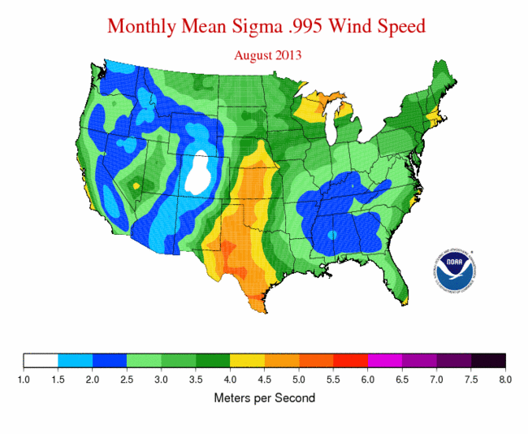

## Introduction

**Goal**. You've been tasked by the United Nations to assess countries with highest possible wind energy production.

This lab, similar to the wind siting analysis Lab 3 from ESM 263 (GIS), has you examining wind data for wind farm site suitability. However here we'll only be looking at the wind production aspect globally and not other finer scale suitability components. Although simplified in that sense we'll be adding a few dimensions:

- **Time**. Rather than being provided average wind production throughout the year, you're provided with daily wind data for a given year. The task then is to work out an annual average. This introduces analysis in time and necessitates a looping strategy. We'll show you how to do this in Model Builder with Iterators and programmatically in Python. You'll learn only the cursory basics in Python for now to complete the task. You'll then create a Script Tool to easily perform the same analysis for any year of data. You'll also learn how to visualize geographic elements temporally using the Time Slider and even outputting a video.

- **Polar Coordinates**. Rather than simply given the wind speed, you are provided wind speed in the horizontal ($u$) and vertical ($v$) direction. These vectors in a "polar coordinate system" can be translated into the "Cartesian coordinate system" giving us the speed ($s$) using good ol' Pythagorean theorem [^polar]:

    $$
    s = \sqrt{u^2 + v^2}
    $$
  
[^polar]: For details on conversion betwen coordinate systems, see [Wikipedia: Polar coordinate system - Converting between polar and Cartesian coordinates](http://en.wikipedia.org/wiki/Polar_coordinate_system#Converting_between_polar_and_Cartesian_coordinates). Note that the [geographic coordinate system](http://en.wikipedia.org/wiki/Geographic_coordinate_system) and [projected coordinate systems](http://en.wikipedia.org/wiki/Map_projection) are for measuring locations and not angle & magnitude like the polar / Cartesian coordinate systems here.

- **Scientific Data Format**. You'll notice the $u$ and $v$ data files also have a *.nc filename extension which stands for "NetCDF" (Network Common Data Format) developed originally by climate scientists for exchanging scientific data in a variety of structures. Another common open-source scientific data format developed by the remote sensing community is "HDF" (Hierarchical Data Format)[^netcdf-hdf]. In this case the $u$.nc and $v$.nc data represent a cube of dimensions $x$, $y$ and $t$. We'll be extracting a time slice $t$ of the $u$ or $v$ wind values over the $x$ and $y$ direction.

    
    <!-- source: https://docs.google.com/a/nceas.ucsb.edu/drawings/d/1K1ruRAgXhz6A8IgzgD4eXgXZTHakQZ75oF3rWZK1Wv8/edit -->

[^netcdf-hdf]: Details for [NetCDF from UCAR](http://www.unidata.ucar.edu/software/netcdf/) and [HDF from NCSA](http://www.hdfgroup.org/).

## Data

- **NCEP Reanalysis Wind Data**<br>
  http://www.ncdc.noaa.gov/societal-impacts/wind
    - spatial resolution: 2.5 x 2.5 degrees and temporal resolution daily.
    - temporal resolution: daily
    - file format: netcdf (*.nc)
  
    
  
- **Natural Earth | 1:10m Cultural Vectors | Admin 0 – Countries**<br>
  http://www.naturalearthdata.com/downloads/10m-cultural-vectors/10m-admin-0-countries/
    - spatial resolution: 1:10m
    - version: 
    - file format: shapefile (*.shp)
    
    

## Methods


### Extract Raster Layer from NetCDF


### Calculate Speed from U and V Winds


### Resample Raster

At this point export a PNG of your Model for your writeup.

### Use Iterator


### Export to Script

Get a command line going...


### Python Walk Through

Ok, let's start with our motivation.

```python
import antigravity
```

And now using the ArcGIS module `arcpy`. 

```python
import arcpy

# get loopy
for i in xrange(1,4):
  arcpy.RasterCoolio(i)
```

#### WinPython

#### ArcMap Python Command Line


### Save to Markdown

For tips, see: https://help.github.com/articles/markdown-basics


This dataset is available daily and globally at , and the gridded data is interpolated down to a 0.25 X 0.25 degree resolution to provide finer detail.

The monthly mean wind speed and the monthly wind speed anomaly with respect to the 1971-2000 base period are calculated from the daily average U (east-west) and V (north-south) wind components and plotted for the contiguous United States. 
    


