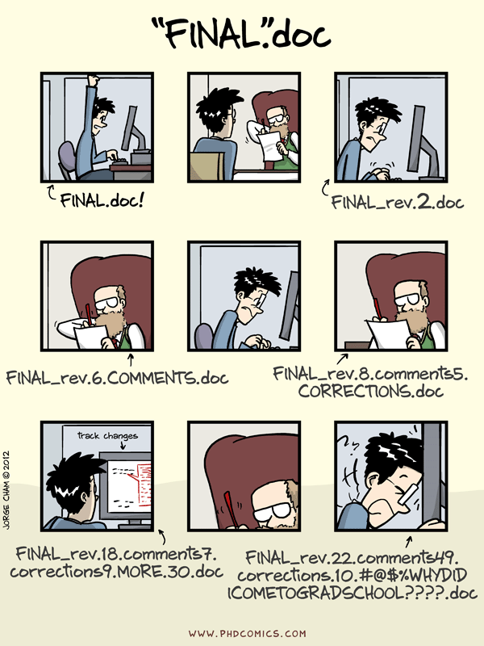

## Learning Goals {.smaller}

- technologies:
    - version control with **Git**, **GitHub**
    - publish web pages with **markdown**
    - program in **Python**: arcpy module for ArcGIS functions; looping, variables...
    - program in **R**: open-source, cross-platform; embed chunks of R in markdown: Rmarkdown
    - publish web maps: **Leaflet javascript**, **ArcGIS Online**
- conservation analysis:
    - **siting wind farms**
    - building **species distribution models**
    - assessing an **ecosystem service** (coastal protection)
  
## Motivation: Reproducible Research {.flexbox .vcenter}

<footer class="source">
Source: Gandrud, C. (2013). **Reproducible Research with R and RStudio**. Boca Raton: Chapman and Hall/CRC.
</footer>

## Why Git, Github?

<footer class="source">
Source: http://www.phdcomics.com/comics/archive.php?comicid=1531
</footer>

## Why Python?

<footer class="source">
Source: http://xkcd.com/353/
</footer>

