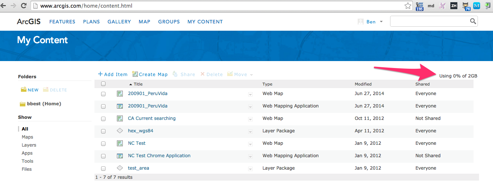

## Consuming vs Publishing

Consuming:
- [ArcGIS Help 10.2 - About using OGC service layers](http://resources.arcgis.com/en/help/main/10.2/index.html#//00sp0000000n000000)
- [ArcGIS Help 10.2 - Make WCS Layer (Data Management)](http://resources.arcgis.com/en/help/main/10.2/index.html#//00170000006w000000)

Publishing:
- [Esri Training | Creating Hosted Map Services with ArcGIS Online](http://training.esri.com/gateway/index.cfm?fa=catalog.webCourseDetail&courseid=2563)

## Free

- Github with Leaflet, rawgit.com of HTML
- Google Fusion / Maps
- ...
- https://wiki.state.ma.us/confluence/display/massgis/GeoServer+-+WFS+-+Examples

## ArcGIS Online

Looks like you can have a FREE 2 GB account. ([ArcGIS Online FAQ](http://www.esriuk.com/products/arcgis-online/faqs) says need a subscription, although 30 days free available, presumably for private content.)

  

- [Quick Start Guide to ArcGIS Online for FREE Public Accounts](http://www.esri.com/library/brochures/pdfs/quick-start-arcgis-online.pdf)
- [Quick Start Guide to ArcGIS Online for Organizations](http://www.esri.com/library/brochures/pdfs/quick-start-arcgis-online-organizations.pdf)

- [ArcGIS - Wind Energy Tutorial](http://www.arcgis.com/home/group.html?owner=esriuk.bureau&title=Wind%20Energy%20Tutorial)
- [ArcGIS Online Tutorial – Creating a Web Map to show Wind Energy in the UK](https://www.esriuk.com/sites/default/files/uploads/ArcGIS%20Online%20Tutorial%20v1.0.pdf)

- [Esri Training | Creating Hosted Map Services with ArcGIS Online](http://training.esri.com/gateway/index.cfm?fa=catalog.webCourseDetail&courseID=2563)
- [Make an app | Learn ArcGIS](http://learn.arcgis.com/en/projects/get-started-with-arcgis-online/lessons/make-an-app/)