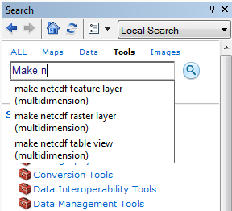

**Due**: 8am Wednesday, 08 October 2014

**Points**: 10 points

# Introduction

**Goal**. You've been tasked by the United Nations to assess countries with highest possible wind energy production.

**Tasks**. Step by step instructions are provided for this lab. In the end you'll be submitting a report to your Github courses repository with the following elements:

- image of a basic model extracting the data to a raster of wind speed
- image of a model using a For iterator to loop over days of the year
- global map of maximum wind speed by country
- Python script creating the data

This lab, similar to the wind siting analysis Lab 3 from ESM 263 (GIS), has you examining wind data for wind farm site suitability. However here we'll only be looking at the wind production aspect globally and not other finer scale suitability components. Although simplified in that sense we'll be adding a few dimensions:

- **Time**. Rather than being provided average wind production throughout the year, you're provided with daily wind data for a given year. The task then is to work out an annual average. This introduces analysis in time and necessitates a looping strategy. We'll show you how to do this in Model Builder with Iterators and programmatically in Python. You'll learn only the cursory basics in Python for now to complete the task. You'll also learn how to visualize geographic elements temporally using the Time Slider and even outputting a video.

- **Polar Coordinates**. Rather than simply being given the wind speed, you are provided wind speed in the horizontal ($u$) and vertical ($v$) direction. These vectors are in the "Cartesian coordinate system" and can be translated into the "polar coordinate system" giving us the speed ($s$) using good ol' Pythagorean theorem [^polar]:

  
  <!-- 
  Google drawing source:
  https://docs.google.com/a/nceas.ucsb.edu/drawings/d/1PFUPMmjjDKs6SHRVVPFy4hY0G9oSzR5cer39ShS0PiU/edit 
  -->

  $$
  s = \sqrt{u^2 + v^2}
  $$
  
  $$
  \theta = atan2(u, v)
  $$
  
[^polar]: For details on conversion betwen coordinate systems, see [Wikipedia: Polar coordinate system - Converting between polar and Cartesian coordinates](http://en.wikipedia.org/wiki/Polar_coordinate_system#Converting_between_polar_and_Cartesian_coordinates). Note that the [geographic coordinate system](http://en.wikipedia.org/wiki/Geographic_coordinate_system) and [projected coordinate systems](http://en.wikipedia.org/wiki/Map_projection) are for measuring locations and not angle & magnitude like the polar / Cartesian coordinate systems here.

- **Scientific Data Format**. You'll notice the $u$ and $v$ data files also have a *.nc filename extension which stands for "NetCDF" (Network Common Data Format) developed originally by climate scientists for exchanging scientific data in a variety of structures. Another common open-source scientific data format developed by the remote sensing community is "HDF" (Hierarchical Data Format)[^netcdf-hdf]. In this case the $u$.nc and $v$.nc data represent a cube of dimensions $x$, $y$ and $t$. We'll be extracting a time slice $t$ of the $u$ or $v$ wind values over the $x$ and $y$ direction.

    
    <!-- 
    Google Drawing source: 
    https://docs.google.com/a/nceas.ucsb.edu/drawings/d/1K1ruRAgXhz6A8IgzgD4eXgXZTHakQZ75oF3rWZK1Wv8/edit
    -->

[^netcdf-hdf]: Details for [NetCDF from UCAR](http://www.unidata.ucar.edu/software/netcdf/) and [HDF from NCSA](http://www.hdfgroup.org/).

Finally, you'll be using the best of breed scientific programming tools to track changes in the files you create (**git**) and publish an executive summary report to an online project management interface (**Github**). You'll make this report in a language (**markdown**) that easily converts to an html web page (and other formats).

# Data

- **NCEP Reanalysis Wind Data**<br>
  http://www.ncdc.noaa.gov/societal-impacts/wind
    - spatial resolution: 2.5 x 2.5 degrees
    - temporal resolution: daily
    - file format: netcdf (*.nc)
    - files: `H:\esm296-4f\lab1\raw\uwnd.sig995.2013.nc`, `vwnd.sig995.2013.nc`
  
    
  
- **Natural Earth | 1:10m Cultural Vectors | Admin 0 – Countries**<br>
  http://www.naturalearthdata.com/downloads/10m-cultural-vectors/10m-admin-0-countries/
    - spatial resolution: 1:10m
    - version: 3.1.0
    - file format: shapefile (*.shp)
    - file: `H:\esm296-4f\lab1\raw\ne_10m_admin_0_countries.shp`
    
    

# Methods

## Setup your Github courses repository

See [git](https://rawgit.com/ucsb-bren/esm296-4f/master/wk1/git.html) for detailed instructions.

## Download Data

You can use the URLs above to download the data or just download the 7-zipped file:

https://purl.org/net/frew/ESM296/wk1/raw.7z

I recommend placing this in `H:\esm296-4f\lab1`, right clicking 7-Zip > Extract here.

## Prep Workspace

Fire up ArcMap and create in the Catalog pane:

- a new blank map, save it in `H:\esm296-4f\lab1` as `lab1.mxd`.
- new file geodatabase as `lab1.gdb`
- new toolbox as `lab1.tbx`
- new folder `out`

Right click on lab1.gdb to Make Default Geodatabase.

You'll need to have the Spatial Analyst extension ticked on (ArcMap menu Customize > Extensions)

## Extract Raster Layer from NetCDF

Create a new Model within lab1.tbx and Edit it. Set Model > Model Properties to "Store relative path names" and give it a label of "uv_nc_to_s_tif" (you can keep the default model name).

You'll be asked to find tools for adding to Model Builder or running independantly. I find the easiest way is to use the Search Window (click on ), click Tools and Type there.



Now add the [Make NetCDF Raster Layer](http://resources.arcgis.com/en/help/main/10.2/index.html#//004300000006000000) tool navigate to the input file `raw/uwnd.sig995.2013.nc` (note: `u` and `2013`) with further parameters like so:


In order to populate Dimension of "time" Value of 1, you'll need to select "time" from the Dimension values drop down.

Run this tool to see the output in ArcMap. You might need to right-click on the output  Add To Display.

Repeat for the `v` and `2013` file, swapping out instances of `u` for `v`.

## Calculate Speed from U and V Winds

Now we're ready to calculate the speed $s$ given vectors $u$ and $v$ using the [Raster Calculator](http://resources.arcgis.com/en/help/main/10.2/index.html#//009z000000z7000000). Apply the equation

  $$
  s = \sqrt{u^2 + v^2}
  $$

by entering the following parameters, choosing the variables (green triangle) and not layers (yellow diamond).

  

Notice the output is `in_memory\s_001` since we're not quite to the final product so don't need to write to disk just yet. This uses the [`in_memory` workspace](http://resources.arcgis.com/en/help/main/10.2/index.html#//002w0000005s000000) so the interim output is not written to disk, but simply kept in memory for your session, like a layer.


## Resample Raster

If you add a global basemap (File > Add Data > Add Basemap...) and make just `s_001` visible with some transparency, you'll notice that this is much chunkier than Figure 1 above since that was resampled at 0.25 x 0.25 degrees from the original global 2.5 x 2.5 degrees raster. Let's [Resample](http://resources.arcgis.com/en/help/main/10.2/index.html#//00170000009t000000) at 0.25 x 0.25 resolution using BILINEAR interpolation and output to `H:\esm296-4f\lab1\out\s_001.tif`.

At this point export a PNG of your Model for later writeup (Model > Export > To Graphic...) into `H:\github\courses\esm296-4f\lab1\img\uv_nc_to_s_tif.png`.

## Use Iterator in Model Builder

Ok, so we've got a decent product, but that's only the first time index. And there's 365, one for each day of the year. So let's to get loopy!

This really should motivate you to create script, but you might as well also know about [iterators in ModelBuilder](http://resources.arcgis.com/en/help/main/10.2/index.html#//002w0000001w000000). Iterating through all 365 days is overkill for our purposes. Let's just loop over one day per month.

To start, create another model with Save as... `uv_nc_to_s_tif_for_loop`. Add the For iterator by right clicking on empty part of the ModelBuilder canvas > Iterators, and parameterize like so:

- From Value: 1
- To Value: 365
- By Value: 30

Rename the default "value" output to "j" for [julian day](http://en.wikipedia.org/wiki/Julian_day), ie index day of the year. Be careful not to use "i" or "n" which are reserved variables for [ArcGIS inline variable substitution](http://resources.arcgis.com/en/help/main/10.2/index.html#/A_quick_tour_of_using_inline_variable_substitution/002w0000001t000000/). You should see this in your model:

  

We can then use this variable in the parameters of the other tools by wrapping it with `%` (an old MS-DOS convention).

  

Continue swapping out all instances of `1` or `001` with `%j%` in the function parameters. The working equation for the Raster Calculator is:

```
SquareRoot( Square("u_%j%") + Square("v_%j%") )
```

The link from the $u$ and $v$ as inputs to the Raster Calculator gets lost, so you'll need to tell ModelBuilder to generate the needed $u$ and $v$ outputs (which should be named `u_%j%` and `v_%j%`) before running the Raster Calculator. You can do this by [setting preconditions](http://resources.arcgis.com/en/help/main/10.1/index.html#//002w00000067000000) to the Raster Calculator which ensures these inputs are available first.

Let's walk through a few iterations to fully grasp the inline variable substitution happening with the For iterator which assigns the value of variable `%j%`. All instances of `%j%` are then replaced with this value.

- For: `%j%` -> `1`
- Make NetCDF Raster Layer: `u_%j%` -> `u_1`
- Make NetCDF Raster Layer: `v_%j%` -> `v_1`
- Raster Calculator: `in_memory\s_%j%` -> `in_memory\s_1`
- Resample: `H:\esm296-4f\lab1\out\s_%j%.tif` -> `H:\esm296-4f\lab1\out\s_1.tif`

- For: %j% -> 31
- Make NetCDF Raster Layer: `u_%j%` -> `u_31`
- Make NetCDF Raster Layer: `v_%j%` -> `v_31`
- Raster Calculator: `in_memory\s_%j%` -> `in_memory\s_31`
- Resample: `H:\esm296-4f\lab1\out\s_%j%.tif` -> `H:\esm296-4f\lab1\out\s_31.tif`

...

- For: %j% -> 361
- Make NetCDF Raster Layer: `u_%j%` -> `u_361`
- Make NetCDF Raster Layer: `v_%j%` -> `v_361`
- Raster Calculator: `in_memory\s_%j%` -> `in_memory\s_361`
- Resample: `H:\esm296-4f\lab1\out\s_%j%.tif` -> `H:\esm296-4f\lab1\out\s_361.tif`

Before running, it's a good idea to [Validate the Entire Model](http://resources.arcgis.com/en/help/main/10.2/index.html#//002w0000003n000000) so that no shadows exist and it runs all the tools at each iteration.

Export a PNG image of your model to `H:\github\courses\esm296-4f\lab1\img\uv_nc_to_s_tif_iterator.png`.

## Extract Country Summary

Now that you've extracted monthly slices of the wind speed, you'll want to summarize for the year and then by country to arrive at the desired summary of wind production by country.

You'll need to create a new model (let's label it `country_wind_summary`) to summarize the wind data by country since the **For** iterator executes all tools in the model at every iteration and you only want to run these tools once.

### Cell Statistics

To summarize by year, you want to collapse all the monthly rasters into a single average raster using [Cell Statistics](http://resources.arcgis.com/en/help/main/10.2/index.html#//009z0000007q000000) to get the MEAN wind speed on all the s_2013-##.tif rasters. I recommend outputting this raster to `H:\esm296-4f\lab1\out\s_2013_avg.tif` outside the file geodatabase. (Be careful not to include the s_001.tif from the first model so as to avoid double counting the first month.)

### Zonal Statistics

Next, you'll want to summarize by country. Each country has many pixels in it, so let's get the MIN, MAX and MEAN of all average wind speed pixels in the country. To do this use the `H:\esm296-4f\lab1\raw\ne_10m_admin_0_countries.shp` as the zone data with the [Zonal Statistics As Table](http://resources.arcgis.com/en/help/main/10.2/index.html#//009z000000w8000000) to get the MIN_MAX_MEAN per country (recommend using NAME as Zone field).

### Join Field

Now use [Join Field](http://resources.arcgis.com/en/help/main/10.2/index.html#//001700000065000000) to join the output of the zonal statistics output table (join_table) to `H:\esm296-4f\lab1\raw\ne_10m_admin_0_countries.shp` (input_table, using field NAME).

Export a PNG image of your model to `H:\github\courses\esm296-4f\lab1\img\country_wind_summary.png`.

## Create Map of Countries Wind Production

Now visualize the countries shapefile (`H:\esm296-4f\lab1\raw\ne_10m_admin_0_countries.shp`) with the newly added MAX value to create a color ramped global map of max wind production. Use the Natural Jenk's 10 breaks with a rainbow color ramp (blue=low, red=high) for the symbology. Zoom to the layer and File Export map as PNG to `H:\github\courses\esm296-4f\lab1\img\country_wind_map.png`. (No need to make it super pretty with legends and such, just getting the gist.)

## Report in Markdown

Now you'll "write" (or rather copy & paste template below) a cursory report from RStudio menu File > New File > Text File. File > Save As... `H:\github\courses\esm296-4f\lab1\README.md`. For more on markdown (*.md), see Step 3 of the [rmarkdown cheatsheet](rmarkdown_cheatsheet.pdf). Be sure to open the zonal statistics table and sort descending on MAX and MEAN to substitute answers for the top 3 within this file.

```
# Lab 1

## Basic Model


## Model with Iterator


## Summarizing Model


## Country Max Wind Production


## Summary of Top Countries

The top 3 countries by MAX wind speed were:

1. [Country A]
1. [Country B]
1. [Country C]

The top 3 countries by MEAN wind speed were:

1. [Country D]
1. [Country E]
1. [Country F]

```

## Git Commit and Push from RStudio

From your RStudio courses project ("courses" should appear in upper right, not "esm296-4f"; or simply double click `H:\github\courses\courses.Rproj` in Windows Explorer to get there), use the Git pane to Commit all new untracked files (which show up under Status as yellow "??") in the Commit window. You can select multiple files at once by clicking once at the top of the list, holding shift and clicking bottom of list, Stage All. Enter a message that includes the text (without quotes) "closes #2" which will close the Lab 2 issue (assuming it was the second one you created per instructions above; or you can simply visit that issue and close it after). After committing the files, in the Git pane you'll see the info message "Your branch is ahead of 'orgin/master' by 1 commit". The 'origin/master' is actually referring to your Github online repository, so it's saying that you need to still Push the commits to get them to show up online. Be sure to Push your final commits.


If all's well you should see images rendered and your report live here (replace USER with your Github username):

https://github.com/USER/courses/tree/master/esm296-4f/lab1

and your issue for Lab 1 closed here:

https://github.com/USER/courses/issues/2

Since you invited the instructors already to your github site, we should get notified when the issue is closed and can have a look.

Congratulations! You're done.