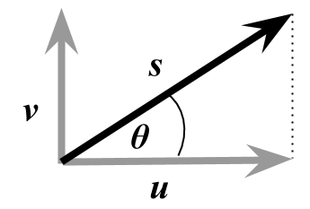
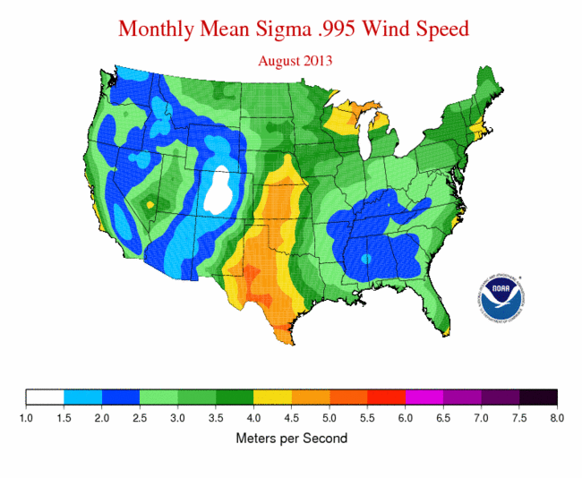
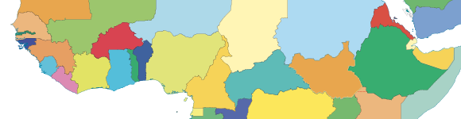
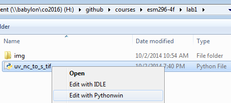
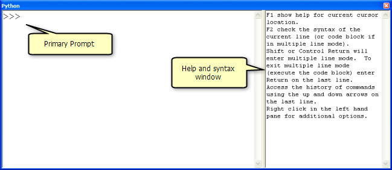
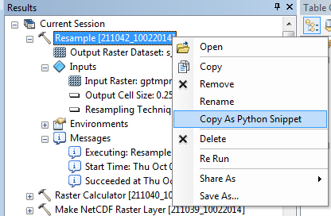
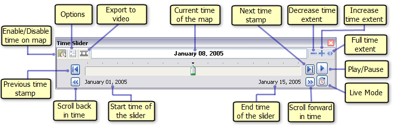
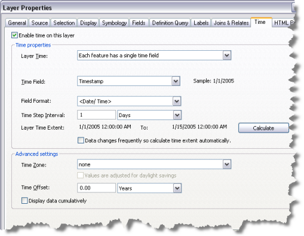
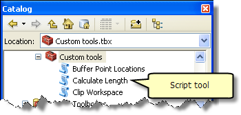
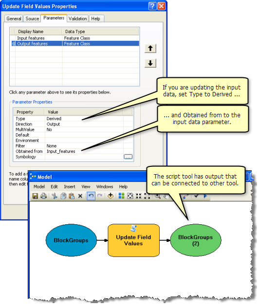

**Due**: 8am Wednesday, 08 October 2014

**Points**: 10 points

# Introduction

**Goal**. You've been tasked by the United Nations to assess countries with highest possible wind energy production.

**Tasks**. Step by step instructions are provided for this lab. In the end you'll be submitting a report to your Github courses repository with the following elements:

- image of a basic model extracting the data to a raster of wind speed
- image of a model using a For iterator to loop over days of the year
- global map of maximum wind speed by country
- Python script creating the data

This lab, similar to the wind siting analysis Lab 3 from ESM 263 (GIS), has you examining wind data for wind farm site suitability. However here we'll only be looking at the wind production aspect globally and not other finer scale suitability components. Although simplified in that sense we'll be adding a few dimensions:

- **Time**. Rather than being provided average wind production throughout the year, you're provided with daily wind data for a given year. The task then is to work out an annual average. This introduces analysis in time and necessitates a looping strategy. We'll show you how to do this in Model Builder with Iterators and programmatically in Python. You'll learn only the cursory basics in Python for now to complete the task. You'll also learn how to visualize geographic elements temporally using the Time Slider and even outputting a video.

- **Polar Coordinates**. Rather than simply being given the wind speed, you are provided wind speed in the horizontal ($u$) and vertical ($v$) direction. These vectors are in the "Cartesian coordinate system" and can be translated into the "polar coordinate system" giving us the speed ($s$) using good ol' Pythagorean theorem [^polar]:

  
  <!-- 
  Google drawing source:
  https://docs.google.com/a/nceas.ucsb.edu/drawings/d/1PFUPMmjjDKs6SHRVVPFy4hY0G9oSzR5cer39ShS0PiU/edit 
  -->

  $$
  s = \sqrt{u^2 + v^2}
  $$
  
  $$
  \theta = atan2(u, v)
  $$
  
[^polar]: For details on conversion betwen coordinate systems, see [Wikipedia: Polar coordinate system - Converting between polar and Cartesian coordinates](http://en.wikipedia.org/wiki/Polar_coordinate_system#Converting_between_polar_and_Cartesian_coordinates). Note that the [geographic coordinate system](http://en.wikipedia.org/wiki/Geographic_coordinate_system) and [projected coordinate systems](http://en.wikipedia.org/wiki/Map_projection) are for measuring locations and not angle & magnitude like the polar / Cartesian coordinate systems here.

- **Scientific Data Format**. You'll notice the $u$ and $v$ data files also have a *.nc filename extension which stands for "NetCDF" (Network Common Data Format) developed originally by climate scientists for exchanging scientific data in a variety of structures. Another common open-source scientific data format developed by the remote sensing community is "HDF" (Hierarchical Data Format)[^netcdf-hdf]. In this case the $u$.nc and $v$.nc data represent a cube of dimensions $x$, $y$ and $t$. We'll be extracting a time slice $t$ of the $u$ or $v$ wind values over the $x$ and $y$ direction.

    
    <!-- 
    Google Drawing source: 
    https://docs.google.com/a/nceas.ucsb.edu/drawings/d/1K1ruRAgXhz6A8IgzgD4eXgXZTHakQZ75oF3rWZK1Wv8/edit
    -->

[^netcdf-hdf]: Details for [NetCDF from UCAR](http://www.unidata.ucar.edu/software/netcdf/) and [HDF from NCSA](http://www.hdfgroup.org/).

Finally, you'll be using the best of breed scientific programming tools to track changes in the files you create (**git**) and publish an executive summary report to an online project management interface (**Github**). You'll make this report in a language (**markdown**) that easily converts to an html web page (and other formats).

# Data

- **NCEP Reanalysis Wind Data**<br>
  http://www.ncdc.noaa.gov/societal-impacts/wind
    - spatial resolution: 2.5 x 2.5 degrees
    - temporal resolution: daily
    - file format: netcdf (*.nc)
  
    
  
- **Natural Earth | 1:10m Cultural Vectors | Admin 0 – Countries**<br>
  http://www.naturalearthdata.com/downloads/10m-cultural-vectors/10m-admin-0-countries/
    - spatial resolution: 1:10m
    - version: 3.1.0
    - file format: shapefile (*.shp)
    
    

# Methods

## Setup your Github courses repository

See [git](https://rawgit.com/ucsb-bren/esm296-4f/master/wk1/git.html) for detailed instructions.

## Download Data

You can use the URLs above to download the data or just download the 7-zipped file:

https://purl.org/net/frew/ESM296/wk1/raw.7z

I recommend placing this in `H:\esm296-4f\lab1`, right clicking 7-Zip > Extract here.

## Prep Workspace

Fire up ArcMap and create in the Catalog pane:

- a new blank map, save it in `H:\esm296-4f\lab1` as `lab1.mxd`.
- new file geodatabase as `lab1.gdb`
- new toolbox as `lab1.tbx`
- new folder `out`

Right click on lab1.gdb to Make Default Geodatabase.

You'll need to have the Spatial Analyst extension ticked on (ArcMap menu Customize > Extensions)

## Extract Raster Layer from NetCDF

Create a new Model within lab1.tbx and Edit it. Set Model > Model Properties to "Store relative path names" and give it a name and label of "uv_nc_to_s_tif".

Now add the [Make NetCDF Raster Layer](http://resources.arcgis.com/en/help/main/10.2/index.html#//004300000006000000) tool navigate to the input file `raw/uwnd.sig995.2013.nc` (note: `u` and `2013`) with further parameters like so:


Run this tool to see the output in ArcMap. You might need to right-click on the output  Add To Display.

Repeat for the `v` and `2013` file, swapping out instances of `u` for `v`.

## Calculate Speed from U and V Winds

Now we're ready to calculate the speed $s$ given vectors $u$ and $v$ using the [Raster Calculator](http://resources.arcgis.com/en/help/main/10.2/index.html#//009z000000z7000000). Apply the equation

  $$
  s = \sqrt{u^2 + v^2}
  $$

by entering the following parameters, choosing the variables (green triangle) and not layers (yellow diamond).

  

Notice the output is `in_memory\s_001` since we're not quite to the final product so don't need to write to disk just yet. This uses the [`in_memory` workspace](http://resources.arcgis.com/en/help/main/10.2/index.html#//002w0000005s000000) so the interim output is not written to disk, but simply kept in memory for your session, like a layer.


## Resample Raster

If you add a global basemap (File > Add Data > Add Basemap...) and make just `s_001` visible with some transparency, you'll notice that this is much chunkier than Figure 1 above since that was resampled at 0.25 x 0.25 degrees from the original global 2.5 x 2.5 degrees raster. Let's do the same with the [Resample](http://resources.arcgis.com/en/help/main/10.2/index.html#//00170000009t000000) function using BILINEAR interpolation and output to `H:\esm296-4f\lab1\out\s_001.tif`.

At this point export a PNG of your Model for later writeup (Model > Export > To Graphic...) into `H:\github\courses\esm296-4f\lab1\img\uv_nc_to_s_tif.png`.

## Use Iterator in Model Builder

Ok, so we've got a decent product, but that's only the first time index. And there's 365, one for each day of the year. So let's to get loopy!

This really should motivate you to create script, but you might as well also know about [iterators in ModelBuilder](http://resources.arcgis.com/en/help/main/10.2/index.html#//002w0000001w000000). Iterating through all 365 days is overkill for our purposes. Let's just loop over one day per month.

To start, create another model with Save as... `uv_nc_to_s_tif_for_loop`. Add the For iterator by right clicking on empty part of the ModelBuilder canvas > Iterators, and parameterize like so:

- From Value: 1
- To Value: 365
- By Value: 29

Rename the default "value" output to "j" for [julian day](http://en.wikipedia.org/wiki/Julian_day), ie index day of the year. Be careful not to use "i" or "n" which are reserved variables for [ArcGIS inline variable substitution](http://resources.arcgis.com/en/help/main/10.2/index.html#/A_quick_tour_of_using_inline_variable_substitution/002w0000001t000000/). You should see this in your model:

  

We can then use this variable in the parameters of the other tools by wrapping it with `%` (an old MS-DOS convention).

  

Continue swapping out all instances of `1` or `001` with `%j%` in the function parameters. The working equation for the Raster Calculator is:

```
SquareRoot( Square("u_%j%") + Square("v_%j%") )
```

The link from the u and v input to Raster Calculator gets lost, so you'll need to link `u_%j%` and `v_%j%` to the Raster Calculator as a "precondition" so these get generated first and are available to the Raster Calculator.


## Export to Script

While it gets the job mostly done, there are a few reasons I don't like the above approach:

- The %j% substitution can get a little confusing.
- The outputs don't sort well since they're not zero padded like s_001.tif.
- The julian day or index number makes it hard to tell which month it should refer to and it won't be the middle of the month exactly.
- Every function within the model having an Iterator gets repeated that many times. We can't perform a single process before to prepare the data nor after to summarize unless we [create model parameters](http://resources.arcgis.com/en/help/main/10.2/index.html#//002w0000003z000000) and nest one model within another. Doable but less than straightforward.

Instead, let's start programming in Python where we have freedom for more sophisticated all-in-one analysis. To get started export the uv_nc_to_s_tif model (before including the iterator) to a Python script (Model Builder menu Model > Export > To Python Script...) and save to `H:\github\courses\esm296-4f\lab1\uv_nc_to_s_tif.py`.

Since you placed your script in the courses repo, you should see it show up in the git pane.

.

Go ahead and click on Commit tick the file to add it, include a message and click on Commit. Then as we improve upon the script you can see which parts changed and even revert back to past versions if needed.

## WinPython

Let's use a Python editor to open the script. You can simply navigate there in Windows Explorer, right click > Edit with Pythonwin.



## Intro to Python

Let's look at a few sample lines of the exported code from ModelBuilder. Like  Git Bash, Python comments are preceeded with `#`.

```python
# Import arcpy module
import arcpy

# Check out any necessary licenses
arcpy.CheckOutExtension("spatial")

# Local variables:
uwnd_sig995_2013_nc = "H:\\esm296-4f\\lab1\\raw\\uwnd.sig995.2013.nc"

# ...

# Process: Make NetCDF Raster Layer
arcpy.MakeNetCDFRasterLayer_md(uwnd_sig995_2013_nc, "uwnd", "lon", "lat", u_001, "", "time 1", "BY_INDEX")
```

The arcpy module is what provides all the ArcGIS geoprocessing functions. Syntax follows `object.function()` or `object.property`. Input arguments to a function are surrounded by paranthesis and seperated by commas. Assignment of variables is with `=` whereas testing equality is `==` which would return True or False. You can try out the following lines in the Interactive Window of PythonWin. 

```python
1 + 1
a = 1
b = 2
a == b

import antigravity
```

While it's a nice editor, you can't simply copy/paste more than one line of code from and Editor window to the Interactive Window (although you can copy multiple lines, right-click in Interactive Window and "Execute python code from clipboard").

## Python Window in ArcMap

I prefer editing code in Winpython and running chunks of code in ArcMap's [Python window](http://resources.arcgis.com/en/help/main/10.2/index.html#//002100000017000000) (available from the main toolbar as ) which does allow copy and paste of multiple lines of code.



Launch the Python Window in ArcMap and try out the following explained in [Using the Python window](http://resources.arcgis.com/en/help/main/10.2/index.html#//002100000018000000).

```python

# hello world
print "Hello Jack!"
count = 0
count

# assignment
x = 1
y = 2
print x + y


# a loop. note the indentation
for count in range(1,5):
  print count
  

# paths: these all work the same when passed to a function
# the backslash is the "escape" character like \n for newline or \t for tab
#   so have to escape the escape character (thanks to Windoze)
# the last one prefixed with r'' for raw format
#   is the cleanest / laziest because you can copy/paste from Explorer
shp = "H:\\esm296-4f\\lab1\\raw\\ne_10m_admin_0_countries.shp"
shp = "H:/esm296-4f/lab1/raw/ne_10m_admin_0_countries.shp"
shp = r"H:\esm296-4f\lab1\raw\ne_10m_admin_0_countries.shp"
shp = r'H:\esm296-4f\lab1\raw\ne_10m_admin_0_countries.shp'

# use arcpy to get the count of features in the shapefile
import arcpy
arcpy.GetCount_management(shp)
```

## Simplify and Loop

The ModelBuilder export is a little verbose and extraneous with its variable naming. Let's clean up the code to make a bit more sense of it in PythonWin so we can get into looping. Go to menu Edit > Replace, copy/paste without quotes below, Replace All:

  - Find:"_001", Replace:""
  - Find:"wnd_sig995_2013", Replace:""

You should then have these extraneous variables:

```python
u = "u"
s = "in_memory\\s"
v = "v"
```

Since these are temporary in memory objects, you can delete their assignment lines above and replace the variable name with their string value in the functions below that. For example `u` to `"u"` from:

```
arcpy.MakeNetCDFRasterLayer_md(u_nc, "uwnd", "lon", "lat", u, "", "time 1", "BY_INDEX")
```

to:

```
arcpy.MakeNetCDFRasterLayer_md(u_nc, "uwnd", "lon", "lat", "u", "", "time 1", "BY_INDEX")
```

Do this for all instances of the `u`,`v`,`s` variables (but not `u_nc`,`v_nc`, `s_tif` -- the input/output variables). Be sure to replace the `s` variable with `"in_memory\\s"` though.

Also replace the `\"%u%\"` and `\"%v%\"` with simply `'u'` and `'v'` since these are no longer needed to perform inline variable substitution for some other raster path value as they did before in ModelBuilder.

Next, let's insert a loop after defining u and v to loop through every 30th day of the year like we did with the Iterator in Model Builder previously.

```python
# loop
for j in range(1, 365, 30):
    
    s_tif = "H:\\esm296-4f\\lab1\\out\\s_%03d.tif" % j
    print s_tif
```

The s_tif has been modified with a [string formatting operation](https://docs.python.org/release/2.4.4/lib/typesseq-strings.html) ot indicate a zero-padded triple digit `%02d` value is expected after the `%` outside the string.

Apply the same logic to `"time 1"` except we don't need zero padding so just `%d` inside the string.

Before you try running the code, I recommend adding this line after `arcpy.CheckOutExtension("spatial")` to enable overwriting output:

```
arcpy.env.overwriteOutput = True
```

Now copy/paste all the code into the ArcMap Python Window. You will probably have to debug some minor syntatic errors (this is the majority effort in programming, truth be told [py-loop-answer]). Once you're able to get this to work, be sure commit your changes.

## Use Dates in Loop

Now that we're in a proper programming environment, we can take advantage of other modules like [datetime](https://docs.python.org/2/library/datetime.html). (Python comes with many [available modules](https://docs.python.org/2/py-modindex.html), hence the term "batteries included".) It would be best if we centered the julian day index on the 15th of the month for each month. To accomplish this, swap in these lines:


```python
yr = 2013
for mo in range(1, 13):

    j = (datetime.date(yr, mo, 15) - datetime.date(yr, 1, 1) + datetime.timedelta(1)).days    
    s_tif = "H:\\esm296-4f\\lab1\\out\\s_%d-%02d.tif" % (yr, mo)
```

For those datetime functions to be available, you'll need to import the module prior (preferably in vicinity of the other `import arcpy` statement).

```python
import datetime
```

## Extract Country Summary

Note that you can type a function in the ArcMap Python Window and on the right hand side it will provide the help documentation for that function.

I also find it handy to run any tool and then go into the [Geoprocessing Results](http://resources.arcgis.com/en/help/main/10.2/index.html#//002100000013000000)) pane (menu Geoprocessing > Results), right click on an executed tool and Copy As Python Snippet to get the function name and all its parameters.

  


Use this trick to add the final three lines to your script. Be sure to navigate to the filesystem path of all the inputs and not use layers only temporarily available in ArcMap memory. This will make the Python snippet reusable in the future and prevent comments like this in your snippets:

```
# Replace a layer/table view name with a path to a dataset (which can be a layer file) or create the layer/table view within the script
# The following inputs are layers or table views: "s_2013_avg_country_stats"
```

### Cell Statistics

[Cell Statistics](http://resources.arcgis.com/en/help/main/10.2/index.html#//009z0000007q000000) to get the MEAN wind speed on all the s_2013-##.tif rasters. I recommend outputting this raster to `H:\esm296-4f\lab1\out\s_2013_avg.tif` outside the file geodatabase.

If you did this the same as me then the first argument looks like this.

```python
"H:/esm296-4f/lab1/out/s_2013-12.tif;H:/esm296-4f/lab1/out/s_2013-01.tif;H:/esm296-4f/lab1/out/s_2013-02.tif;H:/esm296-4f/lab1/out/s_2013-03.tif;H:/esm296-4f/lab1/out/s_2013-04.tif;H:/esm296-4f/lab1/out/s_2013-05.tif;H:/esm296-4f/lab1/out/s_2013-06.tif;H:/esm296-4f/lab1/out/s_2013-07.tif;H:/esm296-4f/lab1/out/s_2013-08.tif;H:/esm296-4f/lab1/out/s_2013-09.tif;H:/esm296-4f/lab1/out/s_2013-10.tif;H:/esm296-4f/lab1/out/s_2013-11.tif","H:/esm296-4f/lab1/out/s_2013_avg.tif"
```
  
which is quite beastly (scroll right). One cool feature of Python is its [list comprehensions](https://docs.python.org/2/tutorial/datastructures.html#list-comprehensions) so above can be condensed.
  
`';'.join(['H:/esm296-4f/lab1/out/s_2013-%02d.tif' % mo for mo in range(1, 13)])`
  
The iterable list is used as input to the [string join](https://docs.python.org/2/library/stdtypes.html#str.join).

### Zonal Statistics

[Zonal Statistics As Table](http://resources.arcgis.com/en/help/main/10.2/index.html#//009z000000w8000000) to get the MIN_MAX_MEAN per country (recommend using NAME as Zone field).

### Join Field

[Join Field](http://resources.arcgis.com/en/help/main/10.2/index.html#//001700000065000000) to join the table back to the original country data.

Once you've added these Python snippets to your code, be sure to commit the final changes to your script and push to your courses repository.

## Create Map of Countries Wind Production

Use the MAX value joined to the country to create a color ramped global map of wind production. Export as PNG to `H:\github\courses\esm296-4f\lab1\img\country_wind.png`.

## Report in Markdown

Now just write a cursory report from RStudio menu File > New File > Text File. File > Save As... `H:\github\courses\esm296-4f\lab1\README.md`. You can use simply use this template. Be sure to open the table and sort descending on MAX and MEAN to substitute answers for top 3.

```
# Lab 1

## Basic Model


## Model with Iterator


## Country Max Wind Production


The top 3 countries by MAX wind speed were:

1. [Country A]
1. [Country B]
1. [Country C]

The top 3 countries by MEAN wind speed were:

1. [Country D]
1. [Country E]
1. [Country F]

## Python Script

[uv_nc_to_s_tif.py](uv_nc_to_s_tif.py)

```

Github automatically renders this markdown, but you can also Preview HTML in RStudio. When you commit it, use the message `closes #2` to flag your lab done. Yay!

You'll learn more about markdown and Rmarkdown next week, but here are some basics:

- [rmarkdown_cheatsheet.pdf](rmarkdown_cheatsheet.pdf)
- https://help.github.com/articles/markdown-basics
- https://guides.github.com/features/mastering-markdown/
- https://stackedit.io

## Extra: Create Raster Catalog for Time Slider Visualization

For kicks and giggles, by loading the rasters into a raster catalog, you can use the [Time Slider](http://resources.arcgis.com/en/help/main/10.2/index.html#//005z0000000z000000) and [create animations](http://resources.arcgis.com/en/help/main/10.2/index.html#/Creating_a_time_animation/000900000069000000/).



Here's the code to populate the raster catalog.

```python
# create raster catalog for use with Time Slider and generating an animation
import os
rasters = ';'.join(['H:/esm296-4f/lab1/out/s_2013-%02d.tif' % mo for mo in range(1, 13)])
catalog = 'H:/esm296-4f/lab1/lab1.gdb/wind_catalog'
arcpy.CreateRasterCatalog_management(os.path.dirname(catalog), os.path.basename(catalog), raster_management_type='UNMANAGED')
arcpy.RasterToGeodatabase_conversion(rasters, catalog)
arcpy.CalculateDefaultGridIndex_management(catalog)
arcpy.AddField_management(catalog, 'date_beg', 'DATE')
arcpy.AddField_management(catalog, 'date_end', 'DATE')
code_block = """
def get_date(s, p):
    y = int(s[2:6])
    m = int(s[7:9])
    if p == 'beg':
        return datetime.datetime(y, m, 1)
    elif p == 'end':
        if m == 12:
            return datetime.datetime(y+1, 1, 1) - datetime.timedelta(1)
        else:
            return datetime.datetime(y, m+1, 1) - datetime.timedelta(1)       
"""
arcpy.CalculateField_management(catalog, 'date_beg', "get_date(!Name!, 'beg')", 'PYTHON_9.3', code_block)
arcpy.CalculateField_management(catalog, 'date_end', "get_date(!Name!, 'end')", 'PYTHON_9.3', code_block)```
```

You'll need to [enable time](http://resources.arcgis.com/en/help/main/10.2/index.html#//005z0000000p000000) on this layer before being able to use the Time Slider.



## EXTRA: Create a Script Tool

We started off in Model Builder and exported to a Python script. You can further take a python script and turn it into a Script Tool to use back in Model Builder or on its own.



Here's a snippet of code to setup input arguments:

```python
import sys

u_nc = sys.argv[1] # "H:\\esm296-4f\\lab1\\raw\\uwnd.sig995.2013.nc"
v_nc = sys.argv[2] # "H:\\esm296-4f\\lab1\\raw\\vwnd.sig995.2013.nc"
yr   = sys.argv[3] # 2013
```

In concept, we could make this script tool take input arguments like above for a different year's worth of data and apply the same analysis. This would require a fair amount of recoding so too much for this lab, but worth sharing the idea.




Here's more on creating Script Tools:

* [ArcGIS Help 10.2 - A quick tour of creating tools with Python](http://resources.arcgis.com/en/help/main/10.2/index.html#//00150000002q000000)
* [ArcGIS Help 10.2 - What is a script tool?](http://resources.arcgis.com/en/help/main/10.2/index.html#//001500000006000000)
* [ArcGIS Help 10.2 - Adding a script tool](http://resources.arcgis.com/en/help/main/10.2/index.html#//00150000001r000000)
* [ArcGIS Help 10.2 - Setting script tool parameters](http://resources.arcgis.com/en/help/main/10.2/index.html#//00150000000n000000)
* [ArcGIS Help 10.2 - Debugging script tools](http://resources.arcgis.com/en/help/main/10.2/index.html#//00150000000m000000)

## More on Python

* [ArcGIS Help 10.2 - Writing Python scripts](http://resources.arcgis.com/en/help/main/10.2/index.html#//002100000021000000)
- [Software Carpentry: Python](http://www.software-carpentry.org/v5/novice/python/index.html)
- [iPython: Gallery of Interesting IPython Notebooks](https://github.com/ipython/ipython/wiki/A-gallery-of-interesting-IPython-Notebooks)
