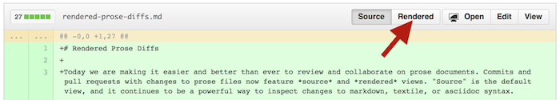

## Learning Goals {.smaller}

- technologies:
    - version control using **Git**
    - project manage at **Github**
    - publish web pages in **markdown**
    - program in **Python**: arcpy module for ArcGIS functions; looping, variables...
    - program in **R**: open-source, cross-platform; embed chunks of R in markdown: Rmarkdown
    - publish web maps: **Leaflet javascript**, **ArcGIS Online**
- conservation analysis:
    - **siting wind farms**
    - building **species distribution models**
    - assessing an **ecosystem service** (coastal protection)
  
# Motivation

## Why Git?

<footer class="source">
Source: http://www.phdcomics.com/comics/archive.php?comicid=1531
</footer>

Git is the versioning engine.

## Why Python?

<footer class="source">
Source: http://xkcd.com/353/
</footer>

Python was developed by Guido Von Rossum, the "benevelont dictator" and fan of Monty Python. All core packages and improvements are blessed by Guido, and conforms to a consistent way of thinking, aka the "pythonic" way (vs Perl / Java / R which have many packages doing similar things). It is said to have "batteries included", hence at its core has what you need.

## Why R? {.flexbox .vcenter}

<footer class="source">
Source: Gandrud, C. (2013). **Reproducible Research with R and RStudio**. Boca Raton: Chapman and Hall/CRC.
</footer>

Originally R was developed by Bell Labs for exploratory data analysis. Now it can be used "soup to nuts" for reproducible science.

# Specifics

## Git / Github Flow

Division of labor:

- git performs these actions
- github stores repositories online

Permissions:

- ucsb-bren/esm296-4f: pull only (no push privileges)
- USER/courses: push and pull

## Git / Github Features

GOOD:

- **text** formats (txt, r, py, md...)
- **backup** to offsite archive, and **rewind** changes
- **document** changes of code and files with issues and messages
- **collaborate** with others and **publish** to web site

BAD:

- **binary** formats (eg docx, pdf, shp...)
- **big** files (limits: 1GB per repository, 100MB per file)

## Folder Structure

So your local file structure will look like this:

H:/

- **github/esm296-4f**: read-only course repo
- **github/courses/esm296-4f**: read-write personal courses repo containing esm296-4f folder
- **esm296-4f/**: personal workspace for working through labs and everything else, especially for big data files

# Cool Features of Github

## Github: Track Changes View

**Track Changes View** with "Rendered" button to view differences between versions of a text file: additions in green, removals in red strikethrough.

## Github: CSV View

**CSV View** allows for on the fly tabular view, searching for text, and linking to specific rows of data. 

## Github: GeoJSON

**Geographic View** of GeoJSON renders automatically as a map.

