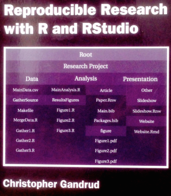

## To Learn {.smaller .build}

Technologies:

- version control using **Git**

- project manage at **Github**

- publish web pages in **markdown**

- program in **Python**: arcpy module for ArcGIS functions; looping, variables...

- program in **R**: open-source, cross-platform; embed chunks of R in markdown: Rmarkdown

- publish web maps: **Leaflet javascript**, **ArcGIS Online**

Conservation analysis:

- **siting wind farms**

- building **species distribution models**

- assessing an **ecosystem service** (coastal protection)
  

# Motivation

## Why Git? {.flexbox .vcenter}

<footer class="source">
Source: http://www.phdcomics.com/comics/archive.php?comicid=1531
</footer>

Git is the versioning engine.

## Why Python? {.flexbox .vcenter}

<footer class="source">
Source: http://xkcd.com/353/
</footer>

Python was developed by Guido Von Rossum, the "benevelont dictator" and fan of Monty Python. All core packages and improvements are blessed by Guido, and conforms to a consistent way of thinking, aka the "pythonic" way (vs Perl / Java / R which have many packages doing similar things). It is said to have "batteries included", hence at its core has what you need.

## Why R? {.flexbox .vcenter}

<footer class="source">
Source: Gandrud, C. (2013). **Reproducible Research with R and RStudio**. Boca Raton: Chapman and Hall/CRC.
</footer>

Originally R was developed by Bell Labs for exploratory data analysis. Now it can be used "soup to nuts" for reproducible science.

# Specifics

## Git / Github Flow  {.flexbox .vcenter}

Division of labor:

- git performs these actions
- github stores repositories online

Other: **BRANCH**, **FORK**

Permissions:

- ucsb-bren/esm296-4f: pull only (no push privileges)
- USER/courses: push and pull

## Git / Github Features

GOOD:

- **text** formats (txt, r, py, md...)
- **backup** to offsite archive, and **rewind** changes
- **document** changes of code and files with issues and messages
- **collaborate** with others and **publish** to web site

BAD:

- **binary** formats (eg docx, pdf, shp...)
- **big** files (limits: 1GB per repository, 100MB per file)

## Folder Structure

So your local file structure will look like this:

**`H:/`**

- **`github/esm296-4f`**  
  read-only repo for course
  
- **`github/courses/esm296-4f`**  
  read-write personal `courses` repo containing `esm296-4f` folder
  
- **`esm296-4f`**  
  personal workspace for working through labs and everything else, especially for big data files

# Cool Features of Github

## Github: Track Changes View

**Track Changes View** with "Rendered" button to view differences between versions of a text file: additions in green, removals in red strikethrough.

## Github: CSV View

**CSV View** allows for on the fly tabular view, searching for text, and linking to specific rows of data. 

## Github: GeoJSON

**Geographic View** of GeoJSON renders automatically as a map.

## Examples  {.smaller}

National Center for Ecological Analysis and Synthesis (NCEAS)  
Open Science for Synthesis 2014: Software Skills Training for Early Career Scientists 
[github.com/nceas/training](https://github.com/nceas/training)
    

 
 
 
 
 
 
 

[Scientific writing: the online cooperative](http://www.nature.com/news/scientific-writing-the-online-cooperative-1.16039) - Nature (01 October 2014) 
_Collaborative browser-based tools aim to change the way researchers write and publish their papers._

# Lab

[**Lab 1**](https://rawgit.com/ucsb-bren/esm296-4f/master/wk1/lab1.html): Wind Energy Lab

