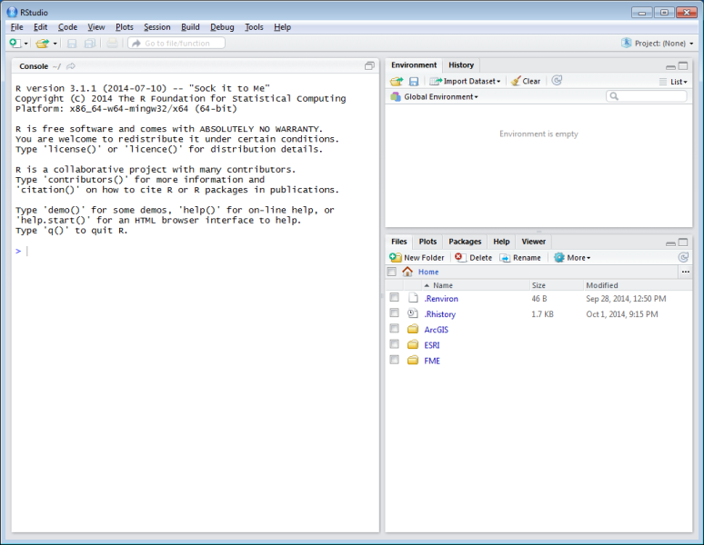

## git bash

Go to Windows button and start typing "Git Bash" (and enter) to launch program.

Try the commands below. Comments are preceeded with `#` and will not do anything (except inform you). You can copy and paste by right-clicking on the upper bar of the Git Bash window (called MINGW32:/...) and selecting Edit > Paste or to copy from the console Edit > Mark, select text, return to put it in your clipboard.


```bash
# list files and folders
ls

# show present working directory
pwd

# tell git YOUR user name and email
git config --global user.name "FIRST LAST"
git config --global user.email YOURS@BREN.UCSB.EDU

# confirm git variables are properly set
git config --global --list

# make directory to store your github repositories
mkdir github

# change directory to github
cd github

# clone the class repository
git clone git@github.com:ucsb-bren/esm296-4f.git

# change directory back to home, ie H: drive
cd ~
```

## RStudio

Now you've cloned the class repository. Let's have a look at it in RStudio. Launch the RStudio program. You should see a window like this:



Now setup Tools > Global Options...

- Git/SVN > Git executable: Browse... and paste `C:\Program Files (x86)\Git\bin\git.exe`

- R General
    - untick: Restore .Rdata into workspace at startup
    - Save workspace to .RData on exit: Never
    
- OK, and restart RStudio

Notice the panes in the upper right: Environment, History. Now click on the drop-down in furthest upper right Project: (None) > Open Project... and navigate to `H:\github\esm296-4f\esm296-4f.Rproj`. This is an RStudio project file that simply points to a folder and retains project specific options. You should now see an extra an extra pane in the upper right: Git.


To synchronize the course content on Github with your local H drive, all you need to do is click the blue down arrow. This is equivalent to the following commands in the Git Bash shell:

```bash
cd ~/github/esm296-4f
git pull
```

### clone [esm296-4f]

git clone https://github.com/ucsb-bren/esm296-4f

git@github.com:bbest/courses.git

### setup rstudio [esm296-4f]


File > New Project...
Version Control > Git > 

https://github.com/bbest/courses.git


## file srxr

- H:/
    - R/
    - github/
        - esm296-4f/ course repo
        - courses/   personal repo
            - esm296-4f/
    - esm296-4f/  workspace, especially for big data files


## github setup

- invite profs: bbest, frew, lwedding?
- create an issue

## git setup

[master 0c8e9e3] adding R setup
 Committer: unknown <bbest_student@frew-test.esm.ucsb.edu>
Your name and email address were configured automatically based
on your username and hostname. Please check that they are accurate.
You can suppress this message by setting them explicitly:


After doing this, you may fix the identity used for this commit with:

    git commit --amend --reset-author

 1 file changed, 17 insertions(+)
 create mode 100644 wk01_programming/setup_r.R
