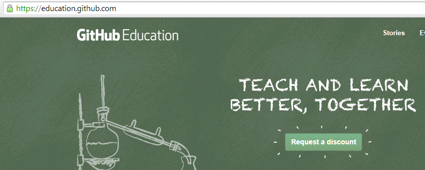
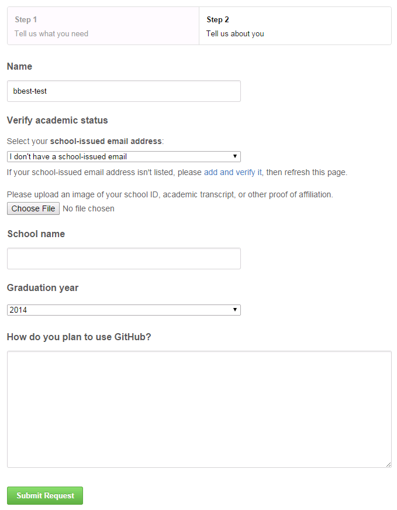

# Git Bash

Go to Windows button and start typing "Git Bash" (and enter) to launch program.

Try the commands below. Comments are preceeded with `#` and will not do anything (except inform you). You can copy and paste by right-clicking on the upper bar of the Git Bash window (called MINGW32:/...) and selecting Edit > Paste or to copy from the console Edit > Mark, select text, return to put it in your clipboard.


```bash
# list files and folders
ls

# show present working directory
pwd

# make directory to store your github repositories
mkdir github

# change directory to github
cd github

# clone the class repository
git clone https://github.com/ucsb-bren/esm296-4f.git

# change directory to inside the newly created esm296-4f folder
ls esm296-4f

# look at files in new directory of cloned repository
ls

# change directory back to home, ie H: drive
cd ~
```

# Github 

## Sign up for Github

You will be turning in assignments through Github which means you'll need to setup a free USER account by visiting [github.com](https://github.com).

Pick any untaken username (you can [change your username later](https://help.github.com/articles/changing-your-github-username)), use your Bren email (needs a .edu extension for later discount) and set a password. Choose the free account.

Next request the Github Educational Discount at [education.github.com](https://education.github.com).

  

Select Student, Individual account. You'll need to provide some sort of image confirming your student status. I took a screen shot of an email verifying my enrollment. You shouldn't see this note about a school-issued email address if you used your Bren.ucsb.edu email. For "How do you plan to use Github", something like: "I'll be using a private repo to turn in assignments for a graduate level course on Advanced Topics in GIS (at the request of instructor @bbest). Hope to feel the stoke of playing with this trending tech!"

  

Usually only takes a couple days to grant you the [Micro plan](https://github.com/pricing) giving you 7 private repositories free of charge.

## Create Courses Repository

[Create a new repository](https://help.github.com/articles/creating-a-new-repository) called `courses` which will be public for now. Yes, Initialize this repository with a README.

## Create a New Issue

Navigate to your courses repository at `http://github.com/USER/courses`. Go to !Issues (available in the right hand navigation). Create a New Issue with the title "try commit" and submit. You should get your first issue #1. We'll see how we can reference this number in a commit message soon. You can similarly create [issues in the esm296-4f repository](https://github.com/ucsb-bren/esm296-4f/issues) for us to address any bugs with the labs.

  

## Clone Courses Repo

Next, you want to clone the repository to your local machine. Note that the URL can be copied from lower right of the repository main page.

  

Now return to the Git Bash shell to clone your courses repository into `H:\github`. 

```bash
# change directory to your github container folder
cd ~/github

# clone your courses repository
git clone https://github.com/USER/courses.git

# change directory to inside the newly created courses folder
cd courses

# tell git YOUR user name and email
git config user.name "FIRST LAST"
git config user.email YOURS@BREN.UCSB.EDU

# tel git to cache your password
git config credential.helper wincred

# check git status of the repository
git status

# make a directory for this course
mkdir esm296-4f

# notice the status is the same after creating a directory
# because no content (ie files) have been added yet
git status

# touch a file in our class folder to create content
touch esm296-4f/README.md

# now git notices "untracked files" in the esm296-4f directory
git status

# add this folder (and by default all the files contained therein)
git add esm296-4f

# now git notes "changes to be committed" with a new file
git status

# commit those changes with a message and close issue #1
git commit -m "first commit. closes #1"

# now git says your branch is ahead of 'origin/master' by 1 commit
git status

# go ahead and push those changes
# git will prompt you for your Github username and password and remember it for future
git push
```

Now that you've pushed the changes to github, visit your courses repo online and you should see that issue #1 got automatically closed. For more, check out [Mastering Issues](https://guides.github.com/features/issues/).

OK, now you have two way pull and push capability with your Github courses repository. Wouldn't it be nice though to not have to use the command line every time you add a file?

# RStudio

Entrez RStudio which provides a handy little interface for basic git commands.

## Configure RStudio

Launch the RStudio program. First, let's configure RStudio to play nicely with git. Go to the menu Tools > Global Options...

- Git/SVN > Git executable: Browse... and paste `C:\Program Files (x86)\Git\bin\git.exe`

- R General
    - untick: Restore .Rdata into workspace at startup
    - Save workspace to .RData on exit: Never
    
- OK, and restart RStudio


## Pull esm296-4f Repo

Notice the panes in the upper right: Environment, History. Go to menu File > Open Project... (or in furthest upper right Project: (None) > Open Project...) and navigate to `H:\github\esm296-4f\esm296-4f.Rproj`. This is an RStudio project file that simply points to a folder and retains project specific options. You should now see an extra pane in the upper right: Git.


To synchronize the course content on Github with your local H drive, all you need to do is click the blue down arrow. This is equivalent to the following command in the Git Bash shell:

```bash
cd ~/github/esm296-4f
git pull
```

## Pull and Push courses Repo

Let's similarly setup an RStudio project for your courses repo. Go to menu File > New Project... (or in furthest upper right Project: (None) > New Project...) and browse to `H:\github\courses`.


In the Files pane (lower right) click on README.md, modify the text (simply adding a return will do) in the editor pane. Notice the Git pane in which the newly added file courses.Rproj has a "?" Status indicating it is an "untracked file" like `git status` in the Git Bash previously told us. And now the README.md has a status of "M" for modified. 


Now click Commit to get a popup that allows you to tick files or folders (with files inside) to add or confirm modification and enter a commit message (required).


# File Structure

So your local file structure will look like this:

H:/

- **github/esm296-4f/** read-only course repo
- **github/courses/esm296-4f/** read-write personal courses repo containing esm296-4f folder
- **esm296-4f/** personal workspace for working through labs and everything else, especially for big data files

# Create Issues

Invite instructors. From your courses repo main page, Settings > Collaborators and invite: `bbest`, `JamesFrew`, `lwedding`.

Quickly create new issues in your courses repo for:

1. lab1
1. lab2
1. lab3
1. lab4
1. lab5
1. project proposal
1. final project

You can direct questions in private towards us by including `@bbest`, `@JamesFrew`, and/or `@lwedding` in any part of a comment to an issue. Or you can create an issue in the [esm296-4f course repository](https://github.com/ucsb-bren/esm296-4f/issues) for all to see.

# More on Git/Github

- [try.github.io](http://try.github.io): git command line tutorial through browser
- [rogerdudler/git-guide](http://rogerdudler.github.io/git-guide): one page simple guide, "no deep shit"
- [guides.github.com](https://guides.github.com): more in depth per topic
- [software-carpentry/git](http://www.software-carpentry.org/v5/novice/git): great novice walk through and reference
