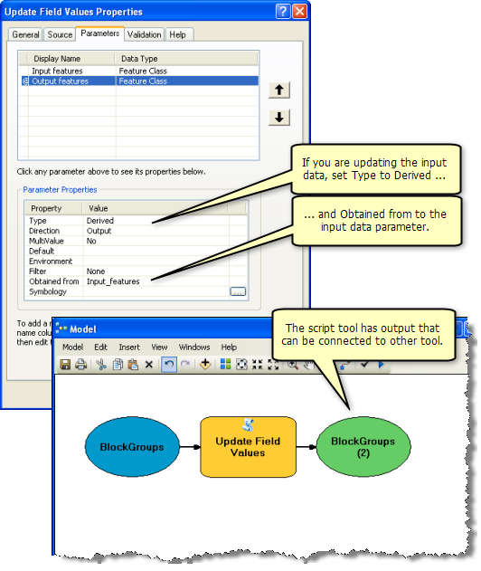

We have limited time with this class to expose you to the vast world of advanced GIS analysis. So here are some extra bits to make you aware of what else is possible, but nothing else in this document is due for homework.

## R Script

Check out the open-source cross-platform equivalent code to accomplish this task in R in [lab2.R](lab2.R). Feel free to open it and try it out yourself. You'll need to run the [lab2_setup.R](lab2_setup.R) first. It also outputs plots to an img folder. If we have time I'll gove over the script in class.

## Use Dates in Loop

Now that we're in a proper programming environment, we can take advantage of other modules like [datetime](https://docs.python.org/2/library/datetime.html). (Python comes with many [available modules](https://docs.python.org/2/py-modindex.html), hence the term "batteries included".) It would be best if we centered the julian day index on the 15th of the month for each month. To accomplish this, swap in these lines:

```python
yr = 2013
for mo in range(1, 13):

j = (datetime.date(yr, mo, 15) - datetime.date(yr, 1, 1) + datetime.timedelta(1)).days    
s_tif = "H:/esm296-4f/labs/lab2/out/s_%d-%02d.tif" % (yr, mo)
```

For those datetime functions to be available, you'll need to import the module prior (preferably in vicinity of the other `import arcpy` statement).

```python
import datetime
```

You can look at a cleaned up version of the script [uv-nc_to_country_monthly.py](uv-nc_to_country_monthly.py).

## Create Raster Catalog for Time Slider Visualization

For kicks and giggles, by loading the rasters into a raster catalog, you can use the [Time Slider](http://resources.arcgis.com/en/help/main/10.2/index.html#//005z0000000z000000) and [create animations](http://resources.arcgis.com/en/help/main/10.2/index.html#/Creating_a_time_animation/000900000069000000/).
                                                                                                   
                                                                                                   
                                                                                                   
                                                                                                   Here's the code to populate the raster catalog.
                                                                                                   
                                                                                                   ```python
                                                                                                   # create raster catalog for use with Time Slider and generating an animation
                                                                                                   import os
                                                                                                   rasters = ';'.join(['H:/esm296-4f/labs/lab2/out/s_2013-%02d.tif' % mo for mo in range(1, 13)])
catalog = 'H:/esm296-4f/labs/lab2/lab2.gdb/wind_catalog'

arcpy.CreateRasterCatalog_management(os.path.dirname(catalog), os.path.basename(catalog), raster_management_type='UNMANAGED')
arcpy.RasterToGeodatabase_conversion(rasters, catalog)
arcpy.CalculateDefaultGridIndex_management(catalog)
arcpy.AddField_management(catalog, 'date_beg', 'DATE')
arcpy.AddField_management(catalog, 'date_end', 'DATE')

code_block = """
def get_date(s, p):
y = int(s[2:6])
m = int(s[7:9])
if p == 'beg':
return datetime.datetime(y, m, 1)
elif p == 'end':
if m == 12:
return datetime.datetime(y+1, 1, 1) - datetime.timedelta(1)
else:
return datetime.datetime(y, m+1, 1) - datetime.timedelta(1)       
"""
arcpy.CalculateField_management(catalog, 'date_beg', "get_date(!Name!, 'beg')", 'PYTHON_9.3', code_block)
arcpy.CalculateField_management(catalog, 'date_end', "get_date(!Name!, 'end')", 'PYTHON_9.3', code_block)```
```

You'll need to [enable time](http://resources.arcgis.com/en/help/main/10.2/index.html#//005z0000000p000000) on this layer before being able to use the Time Slider.


## Create a Script Tool

We started off in Model Builder and exported to a Python script. You can further take a python script and turn it into a Script Tool to use back in Model Builder or on its own.


For example, find the [Multiple Ring Buffer](http://resources.arcgis.com/en/help/main/10.2/index.html#//00080000001p000000) tool in the Analysis toolbox. Right-click > Edit it. You'll see that it's actually just a Python script. Similarly, you can make your script into a tool, allowing any of those early variables to be input as arguments.

Here's a snippet of code to setup input arguments:
  
  ```python
import sys

u_nc = sys.argv[1] # "H:\\esm296-4f\\labs\\lab1\\raw\\uwnd.sig995.2013.nc"
v_nc = sys.argv[2] # "H:\\esm296-4f\\labs\\lab1\\raw\\vwnd.sig995.2013.nc"
yr   = sys.argv[3] # 2013
```

In concept, we could make this script tool take input arguments like above for a different year's worth of data and apply the same analysis. This would require a fair amount of recoding so too much for this lab, but worth sharing the idea.



Here's more on creating Script Tools:
  
  * [ArcGIS Help 10.2 - A quick tour of creating tools with Python](http://resources.arcgis.com/en/help/main/10.2/index.html#//00150000002q000000)
                                                                    * [ArcGIS Help 10.2 - What is a script tool?](http://resources.arcgis.com/en/help/main/10.2/index.html#//001500000006000000)
                                                                                                                  * [ArcGIS Help 10.2 - Adding a script tool](http://resources.arcgis.com/en/help/main/10.2/index.html#//00150000001r000000)
                                                                                                                                                              * [ArcGIS Help 10.2 - Setting script tool parameters](http://resources.arcgis.com/en/help/main/10.2/index.html#//00150000000n000000)
                                                                                                                                                                                                                    * [ArcGIS Help 10.2 - Debugging script tools](http://resources.arcgis.com/en/help/main/10.2/index.html#//00150000000m000000)
                                                                                                                                                                                                                                                                  * [ArcGIS Help 10.2 - Writing Python scripts](http://resources.arcgis.com/en/help/main/10.2/index.html#//002100000021000000)
                                                                                                                                                                                                                                                                                                                