-   Introduction
    -   Learning Goals
-   Data
-   Methods
    -   Reorganize Filesystem
    -   Rename courses to esm296-4f and make private
    -   Open RStudio (and configure git.exe path if needed)
    -   Download Data
    -   Inspect and Run Lab 1 Model
        -   Inspect Sub-Models
        -   Slight Differences in Model
    -   Export Models to Scripts
    -   Open Script in WinPython
    -   Anatomy of an Arcpy Script
    -   Intro to Python
    -   Python Window in ArcMap
    -   Add Loop in Pythonwin
    -   Add Summary Functions to Script
    -   Change to EEZ data
    -   Turn in Report
-   QGIS
-   EXTRA
    -   R Script
    -   Use Dates in Loop
    -   Create Raster Catalog for Time Slider Visualization
    -   Create a Script Tool
-   Further Resources

Introduction
============

The United Nations has tasked you to provide a summary of offshore wind
data (versus terrestrial last time). Once again they want the wind speed
data summarized per country and across months of the year. They also
want the results as a script to easily reproduce and fully document the
parameters for this analysis.

Learning Goals
--------------

Data
====

The data is the same as last week's lab, plus the offshore Exclusive
Economic Zones (EEZ).

-   **NCDC.NOAA.gov: NCEP Reanalysis Wind Data** <br>
    <http://www.ncdc.noaa.gov/societal-impacts/wind>
    -   spatial resolution: 2.5 x 2.5 degrees
    -   temporal resolution: daily
    -   format: netcdf (\*.nc)
    -   files: `H:\esm296-4f\workspace\lab2\raw\uwnd.sig995.2013.nc`,
        `vwnd.sig995.2013.nc`

    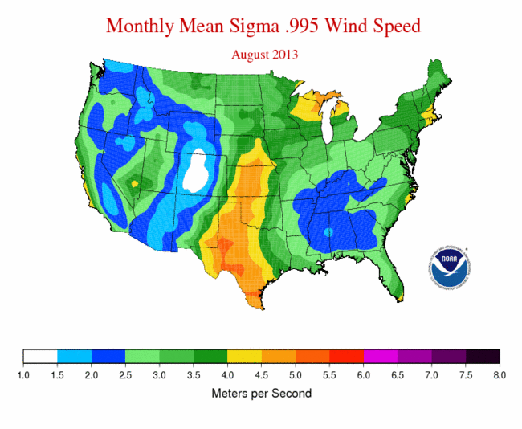

-   **NaturalEarthData.com: 1:10m Cultural Vectors - Admin 0 –
    Countries** <br>
    <http://www.naturalearthdata.com/downloads/10m-cultural-vectors/10m-admin-0-countries/>
    -   spatial resolution: 1:10m
    -   version: 3.1.0
    -   format: shapefile (\*.shp)
    -   file:
        `H:\esm296-4f\workspace\lab2\raw\ne_10m_admin_0_countries.shp`

    

-   **MarineRegions.org: Exclusive Economic Zones Boundaries (EEZ)**
    <br> <http://www.marineregions.org/sources.php#eez>
    -   version: Low res v8 (2014-02-28,
        [history](http://www.marineregions.org/files/eez_v8_changes.php),
        [issues](http://www.marineregions.org/files/World_EEZ_v8_20140228_known_issues.txt),
        [methodology](http://www.marineregions.org/eezmethodology.php))
    -   format: shapefile (\*.shp)
    -   file: `H:\esm296-4f\workspace\lab2\raw\World_EEZ_v8_2014.shp`

    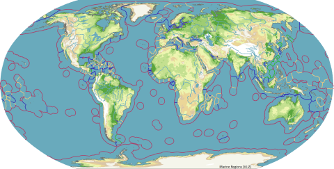

The data this week is bundled into a zip file for you, the download of
which is detailed for you below after doing some file reorganization.

Methods
=======

Reorganize Filesystem
---------------------

The organization of files for this class currently looks like this:

-   **`H:\github\esm296-4f`** <br> read-only repo for course

-   **`H:\github\courses\esm296-4f`** <br> read-write personal courses
    repo containing esm296-4f folder

-   **`H:\esm296-4f`** <br> personal workspace for working through labs
    and everything else, especially for big data files

This system is confusing, understandably. Don't do anything just yet,
but we're going to move things around to look like this:

-   **`H:\esm296-4f\instruction`** <br> downloaded instruction for
    course

-   **`H:\esm296-4f\github`** <br> your read-write personal repo for the
    course

-   **`H:\esm296-4f\workspace`** <br> personal workspace for working
    through labs and everything else, especially for big data files

So all folders will sensibly be contained within `H:\esm296-4f`:
instruction, github, workspace. You'll notice that we're no longer
suggesting you maintain two different Github repositories, one for
course instruction and one for yourself. Instead, you need to only
maintain your read-write course repository, now simply called github.
For the course instruction, it's best to navigate from
<http://tinyurl.com/ESM296> where you'll find the latest linked content.
If you wish to download files for archival purposes, feel free to place
them in the instruction folder.

We'll use Git Bash commands to accomplish this. Except where needing to
make substitutions, please copy from this lab document and paste into
the Git Bash command line window to ensure we have the same paths.

<span class="octicon octicon-info"></span> Tip: **Copy & Paste in Git
Bash**

There are two ways to copy and paste in Git Bash. You can right-click
the top bar to access the menu.


To copy and paste, you can either:

1.  Use the Edit menu. To copy, you first set the mode to Edit \> Mark
    and then left click and hold to select the text, and return to enter
    it into the clipboard. To paste, Edit \> Paste.

2.  Use the shortcuts. First, ensure you have the Default settings by
    selecting Defaults from the menu. Then you don't need to use the
    menu. To copy, simply left-click and hold to select text and return
    to enter it into the clipboard. To paste, simply right-click into
    the window.

Let's start by moving the workspace contents of `H:/esm296-4f/` to
`H:/esm296-4f/workspace/`. (NOTE: We're switching the file path
seperator from Windows backslash `\` to the Linux / Mac / rest of the
world forwardslash `/`. Also, lines beginning with `#` are explanatory
comments and ignored by the Git Bash command line.)

    # change directory to home, ie /h or ~
    cd /h

    # make workspace directory
    mkdir esm296-4f/workspace

    # look at help for the move command, noting sequence of SOURCE DESTINATION arguments 
    mv --help

    # move lab1 into workspace
    mv esm296-4f/lab1 esm296-4f/workspace/lab1

    # list files and folders
    ls esm296-4f

You should only see "workspace" in the output of the last command
listing the contents of the `H:\esm296-4f` folder. If you have other
files or folders, please move them to the new `H:\esm296-4f\workspace`
folder using the mv command similar to above, swapping out lab1 for the
name of the file or folder.

Next, let's move the course instruction `H:\github\esm296-4f` to
`H:\esm296-4f\instruction`.

    mv /h/github/esm296-4f /h/esm296-4f/instruction

Finally, we want to move `H:\github\courses\esm296-4f` to
`H:\esm296-4f\github`. This is trickier. Ideally, you could simply git
clone/commit/push just the esm296-4f subfolder of your courses Github
repository. That turns out to be quite complicated to do and not
recommended. So instead, we'll just have you move the content of the
esm296-4f subfolder up a level, and move that to the new path. Since
you'll be moving content tracked by git, we want to now use "git mv"
(not just "mv") so these changes are tracked before executing a git
commit and git push to update the online Github repo.

    # change into the courses repo so the git commands know to register with that repo
    cd /h/github/courses

    # move the contents of git mv esm296-4f/*  into this root folder of the repo
    git mv esm296-4f/* .

    # remove this now empty directory esm296-4f
    rmdir esm296-4f

    # rename the Rproj file to match the containing folder
    git mv courses.Rproj github.Rproj

    # git status should show a bunch of files being renamed
    git status

    # commit the changes with a message
    git commit -m "reorganize courses repo to being dedicated to esm296-4f"

    # push changes to your github repo
    git push

    # change out of this directory so we can move it to the new path
    cd ~

    # move github/courses to esm296-4f/github
    mv github/courses esm296-4f/github

Now you should have a more sane set of folders all contained within
`H:\esm296-4f\` as described above: github, instruction and workspace.

Rename courses to esm296-4f and make private
--------------------------------------------

You should rename your courses repo on Github since that more accurately
reflects this repo now being dedicated to just this course. While you're
in the settings area, you'll make the repo private. You should've all
recieved your educational discount by now (Please let us know if not).

Start by visiting your repository, and signing in if needed:

<https://github.com/USER/courses>

You should see **Settings** <span class="octicon octicon-tools"></span>
in the right hand navigation pane for the repository (not your upper
right user settings <span class="octicon octicon-gear"></span>). Click
there and:

-   Change Repository name from "courses" to "esm296-4f", Rename

-   Return to the Settings <span class="octicon octicon-tools"></span>,
    go to the "Danger Zone", and click "Make private". You'll have to
    enter "courses" as the repository name to confirm you really want to
    do this. You do -- you're fearless like that in the danger zone!

Open RStudio (and configure git.exe path if needed)
---------------------------------------------------

In Windows Explorer, navigate to `H:\esm296-4f\github` and double-click
on the github R project file to launch RStudio with that project loaded.

Unfortunately the configuration settings in Rstudio that you set in the
[wk1/git](https://rawgit.com/ucsb-bren/esm296-4f/master/wk1/git.html#configure-rstudio)
do not seem to transfer between machines. The only setting you really
need to apply is

RStudio menu Tools \> Global Options \> Git/SVN \> Git executable:
Browse... and paste `C:\Program Files (x86)\Git\bin\git.exe` to look
like this:


If the Git executable path wasn't already set, then you'll need to close
RStudio and reopen `H:\esm296-4f\github\github.Rproj`.

<span class="octicon octicon-info"></span> Aside: **.gitignore**

You might've noticed the `.gitignore` file which RStudio automatically
creates for telling git to ignore some temporary R files. Here's the
contents of the default file when you create an RStudio project in a git
repository.

    .Rproj.user
    .Rhistory
    .RData

You don't want to track any of these files:

-   **.Rproj.user** refers to a folder RStudio creates to store internal
    temporary info for your session.

-   **.Rhistory** file keeps your local command history from the R
    console.

-   **.RData** stores all your environment variables for your session if
    enabled in RStudio options.

It's a good idea to add this .gitignore file, commit and push to github
so that this setting takes effect next time you might clone the repo to
a different machine / path.

Download Data
-------------

Download the prepatory lab2 files here:

<https://purl.org/net/frew/ESM296/wk2/lab2.7z>

I recommend placing this in `H:\esm296-4f`, right clicking 7-Zip \>
Extract here.

Inspect and Run Lab 1 Model
---------------------------

A single model has been created for you which replicates lab 1. Let's
have a look by opening ArcMap and saving a new blank ArcMap document to
`H:\esm296-4f\workspace\lab2\lab2.mxd`. Once you save the document the
other contents in the containing "Home" folder become readily visible in
Catalog. Now open the lab2.tbx and Edit to view the
`country-wind_summary_Params` model.

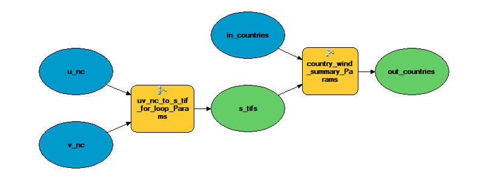

### Inspect Sub-Models

Notice how the "tools" (yellow boxes) are actually models
(). You can right click \> Edit these tools
to open the "sub-models". We had to seperate the models because in the
case of an iterator, all tools in the model are run at every iteration.
Since we want to run the summary tools just once, this model had to be
seperated. The multiple outputs from the first model are gathered with
the [Collect
Values](http://resources.arcgis.com/en/help/main/10.2/index.html#/Examples_of_using_Model_Only_tools_in_ModelBuilder/00400000001m000000/GUID-9F197B15-27F6-46EA-BAC5-7A722C5A3C4E/).
Here's an
[example](http://resources.arcgis.com/en/help/main/10.2/index.html#//00400000001m000000)
of iterating over rasters in a folder with a sub-model.

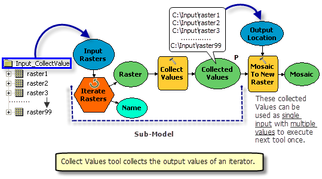

Notice also the use of [model
parameters](http://resources.arcgis.com/en/help/main/10.2/index.html#//002w0000003z000000)
denoted with the big **P** in the sub-models and how these get appied by
the main model. You can double click a sub-model to see its parameters.

For more details on how to do this yourself, check out the [Tutorial:
Creating tools with
ModelBuilder](http://help.arcgis.com/en/arcgisdesktop/10.0/help/index.html#//002w0000007v000000).
We want to move onto programming and not dwell further in Model Builder
world, so merely introducing you to this functionality by example for
now.

### Slight Differences in Model

Besides this nesting of sub-models, we've made a few minor
modifications:

-   Copied the raw/\*countries.shp into the geodatabase with the Copy
    Features tool. This is preferred in principal so that your analysis
    is completely reproducible and therefore shouldn't modify the
    original raw data. Some of you may have also noticed that every time
    you ran the model it would join a new set of fields, not replace any
    existing, so the countries shapefile would end up with multiple
    fields (ie MEAN, MEAN\_1, MEAN\_12, etc). A fresh copy of countries
    now gets copied over to the geodatabase at the begining of the model
    which avoids this problem.

-   For loop starts j at 0. This is because looking again at the
    documentation for the [Make NetCDF Raster
    Layer](http://resources.arcgis.com/en/help/main/10.2/index.html#//004300000006000000)
    you'll notice:

    <blockquote>
    BY\_INDEX — The input value is matched with the position or index of
    a dimension value. The index is 0 based, that is, the position
    starts at 0.
    </blockquote>

Export Models to Scripts
------------------------

The model above gets the job done, but it is a bit convoluted with
nested models and the inline variable substitution. Really, this
analysis motivates writing a script since that environment is much more
suited to iterating through a loop and using variables.

So you can easily export a ModelBuilder model to a python script,
however models with Iterators do not work and nested models don't reveal
the submodels they use. So to get started, you'll want to export from
the lab2.tbx model to a Python script (Model Builder menu Model \>
Export \> To Python Script...) the following:

-   `uv-nc_to_s-tif` to `H:\esm296-4f\github\lab2\uv-nc_to_s-tif.py`

-   `country-wind_summary` to
    `H:\esm296-4f\github\lab2\country-wind_summary.py`

We'll implement looping in the first and append to the second for a
script that does it all.

Open Script in WinPython
------------------------

Take a look at the file `H:\esm296-4f\github\lab2\uv-nc_to_s-tif.py` by
right clicking on it in Windows Explorer \> Edit with Pythonwin.

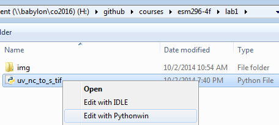

A few observations on Pythonwin:

-   Two windows open:

    1.  Script editor to the file you opened, and

    2.  Interactive Window which is the console into which you can type
        Python commands. Go ahead with your first test of Python after
        the prompt "\>\>\>":

            1 + 1

        Yay, it can at least work as a simple calculator.

-   Use menu Window \> Tile to fill out the window with all open
    windows, and upper right window buttons to minimize / maximize /
    close.

Anatomy of an Arcpy Script
--------------------------

Once again, the "\#" character begins a comment. Note the commented
names for the major sections of the Python script:

-   **\# Import arcpy module**

    First, the arcpy module gets imported. This module contains all the
    tools available in ArcGIS. Notice how it prefixes all the remaining
    statements besides the Local variables section. This
    `module.function()` notation is common amongst object oriented
    languages. More generally, you'll see `object.function()` or
    `object.property`. Functions generally have arguments that are
    specified within the paranthesis and seperated by commas (except a
    small handful of special ones like `import`).

-   **\# Check out any necessary licenses**

    In order for tools from the Spatial Analyst toolbox to run the
    extension needs to be checked out (equivalent to needing to tick the
    Spatial Analyst extension on in the ArcMap menu Customize \>
    Extensions...).

-   **\# Local variables**

    Notice how variable is on the left, equal sign "=" means assignment,
    and value on the right. In this case all variables are strings,
    hence wrapped in quotes. If they were strings and didn't have quotes
    the values would have to either be numeric or the name of another
    assigned variable.

-   **\# Process: **\*

    Here are the tools are doing the actual work. Notice the
    correspondence between the individual arguments set here and how you
    filled out the parameters of the Model Builder forms. Strings are
    used for all arguments except the input and output paths, which are
    assigned to variables. In fact any argument can be assigned a
    variable.

So what's the advantage of assigning a variable? It makes it easy to
change in one location and use in multiple locations. If you don't
expect it to change and are only using in one place then you probably
don't need to assign it to a variable; if it's not going to "vary" then
no need for a variable.

For every tool in ArcGIS there is a corresponding set of documentation
and examples for its use in Python at the bottom of every tool's help
documentation. For example, check out the documentation on the first
tool [Make NetCDF Raster Layer
(Multidimension)](http://resources.arcgis.com/en/help/main/10.2/index.html#//004300000006000000).
The functions generally have the form
CamelCaseToolName\_toolboxshortname, hence "MakeNetCDFRasterLayer\_md"
which is part of the Multidimension toolbox ("\_md").

Intro to Python
---------------

Let's start by typing some code (not copy / paste) in the Pythonwin's
Interactive Window.

Assignment of variables is with `=` whereas testing equality is `==`
which returns True or False. Try the following.

    1 + 1
    a = 1
    b = 2
    a == 1
    a == b
    c = 'a string'
    a + c

That last line should give you an error
`TypeError: unsupported operand type(s) for +: 'int' and 'str'` since
you cannot add an integer and a string. You can however convert a number
to a string and add two strings together. Note that quotes can be either
`"` or `'` which are functionally equivalent.

    str(a) + c 
    str(a) + ' ' + c 
    '%s %d' % (a, c)
    '%s %03d' % (a, c)

The second two lines use [string formatting
operations](https://docs.python.org/release/2.4.4/lib/typesseq-strings.html)
in which the `%` character is special within a string, `%s` for string
or `%d` for digit, and outside it seperates the corresponding arguments.
In the last case `%03d`, you can zero-pad digits, which is a useful for
enbling files to nicely sort (like julian days of our example).

Let's try importing a module.

    import antigravity

Ok, that's a little Python joke (should've launched a web browser to
[xkcd.com/353](http://xkcd.com/353/)). It does point to a couple
interesting aspects of Python though.

1.  Dynamic Typing. This just means that Python figures out how to store
    the variable in memory without needing to be overly verbose as to
    what type of variable it is and allowing it to safely interact with
    other variables. (More details
    [here](https://wiki.python.org/moin/Why%20is%20Python%20a%20dynamic%20language%20and%20also%20a%20strongly%20typed%20language).)

2.  Whitespace. In Python whitespace matters. Indentation means that the
    code executes within the statement (for loop, conditional if, etc)
    as what precedes it.

To see how whitespace matters, try typing this.

    for i in range(1, 13):
        print i
        

Be sure to hit an extra return at the end. Congratulations, you just
executed a loop. Notice how the interpreter automatically indented for
you and the print statement executed for every iteration of the loop.
Also notice how i only goes up to 12, not 13. To see why, look at the
help for this function.

    help(range)
    range(13)

Python is zero index based, ie the first element is indexed by 0 (not
1). So it starts at 0 and ends one less than the end.

Python Window in ArcMap
-----------------------

While Pythonwin is a decent editor, you can't simply copy/paste more
than one line of code from the Editor window to the Interactive Window
(although you can copy multiple lines, right-click in Interactive Window
and "Execute python code from clipboard").

I tend to edit code in Winpython and run chunks of code in ArcMap's
[Python
window](http://resources.arcgis.com/en/help/main/10.2/index.html#//002100000017000000)
(available from the main toolbar as ) which
does allow copy and paste of multiple lines of code and shows you the
results in ArcMap.

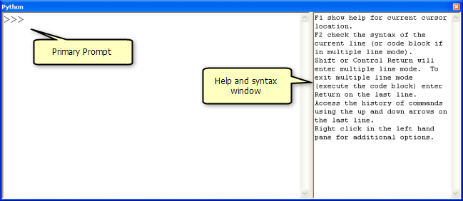

Launch the Python Window in ArcMap and try out the following mostly
explained in [Using the Python
window](http://resources.arcgis.com/en/help/main/10.2/index.html#//002100000018000000).

    # hello world
    print "Hello Jack!"
    count = 0
    count

    # assignment
    x = 1
    y = 2
    print x + y

    # a loop. note the indentation
    for count in range(1,5):
      print count

Paths are usually defined as strings. As already mentioned in
Microsoft's "infinite wisdom" decided to use a new file seperator, and
instead of forward slash `/` (like everyone else) they went with the
backslash `\`, reserved as the special escape character in most all
other languages (eg try `print 'testing \n\t some \tbackslashing` to see
newline and tab characters printed). This turns out to be a regular
annoyance. Here are 3 ways to set the same file path to variable shp.

    shp = "H:\\esm296-4f\\workspace\\lab2\\raw\\World_EEZ_v8_2014.shp"
    shp = "H:/esm296-4f/workspace/lab2/raw/World_EEZ_v8_2014.shp"
    shp = r'H:\esm296-4f\workspace\lab2\raw\World_EEZ_v8_2014.shp'

These all work the same when passed to a function. The last one uses the
prefix `r` for raw format so doesn't interpret the escape character in a
string, which makes it rather convenient to easily copy and paste from
Windows Explorer or Arc Catalog address bar. Could've interchangably
used single quote `'` or double quote `"` - I like the single quote
since it's less bulky.

Assuming you set the variable shp, try importing the arcpy module and
get a count on how many rows in this feature class.

    import arcpy
    arcpy.GetCount_management(shp)

You can type a function in the ArcMap Python Window (where it will try
to auto-complete for you) and on the right hand side it will provide the
help documentation for that function.

<span class="octicon octicon-info"></span> Tip: **Accessing Python
Snippets in Geoprocessing Results Pane**

I also find it handy to run any tool and then go into the [Geoprocessing
Results](http://resources.arcgis.com/en/help/main/10.2/index.html#//002100000013000000))
pane (menu Geoprocessing \> Results), right click on an executed tool
and Copy As Python Snippet to get the function name and all its
parameters.

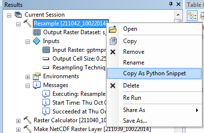

Use this trick to add the final three lines to your script. Be sure to
navigate to the filesystem path of all the inputs and not use layers
only temporarily available in ArcMap memory. This will make the Python
snippet reusable in the future and prevent comments like this in your
snippets:

Add Loop in Pythonwin
---------------------

Let's now insert a loop in the first model builder dumped script. To do
so, return to Pythonwin's editor window with the file
`H:\esm296-4f\github\lab2\uv-nc_to_s-tif.py` and save it (File \> Save
As...) to `H:\esm296-4f\github\lab2\wind_script.py`.

Let's add a loop with the same parameters as the For loop in our Model
Builder model (from 0, to 365, increment 30). Every variable with a
"001" suffix should use string formatting to substitute values, so needs
to be moved down below the for statement. And everything to be looped
needs to be indented.

Here's part of the answer, which you can copy and paste into ArcMap's
command window to try out. (Should print out 13 lines with the unique
filename updated having an incrementing zero padded value of j
substituted.)

    # loop over a range of values for j
    for j in range(0, 365, 30):
        
        # assign values based on variable j
        s_001_tif = "h:\\esm296-4f\\workspace\\lab2\\out\\s_%03d.tif" % j
        print s_001_tif

You'll want to place this loop into the script after defining u and v,
and before the process tools.

Go ahead with moving and updating with the same string formatting trick
the rest of the variables having names ending in "\_001" (u\_001,
v\_001, s\_001, s\_001\_tif).

It's very important you also use variable substitution for the index,
currently `"time 1"`, so each iteration extracts a new slice of data
from the netcdf. Otherwise every iteration will simply be the first
month's data. You don't want zero padding in this case since it's not
formatting a filename to be neatly sorted, but used as an input
parameter to the tool.

You'll need to also update the formula in the Raster Calculator step
from:

    "SquareRoot( Square(\"%u_001%\") + Square(\"%v_001%\") )"

to:

    "SquareRoot( Square('%s') + Square('%s') )" % (u_001, v_001)

The Model Builder syntax for inline variable substitution (wrapping the
variable in percent symbols like `%u_001%`) no longer works in the
Python environment, so you're using the same Python string formatting
approach to update the formula with values of the u\_001 and v\_001,
which are getting updated at every iteration j of the for loop. Note
that originally to include the quote inside a quoted string, the escape
character was needed. Another trick is alternating the quote character
(from `"` to `'`, or vice versa) so escaping is not needed.

Since you might need to run this script more than once to debug any
syntax issues or missing iterators, I recommend adding the following
line to set your arcpy environment to allow overwriting output.

    arcpy.env.overwriteOutput = True

A good place for this is below the arcpy.CheckOutExtension, after import
arcpy and before executing any tools where other arcpy environments are
getting set.

Ok, almost ready to run. First:

-   **Delete contents** from the `H:\esm296-4f\workspace\lab2\out`
    folder so you can be assured it's generating the output.

<span class="octicon octicon-info"></span> Tip: **Selecting Multiple
Items in Catalog**

You can toggle the contents panel in the Catalog window of ArcMap to
enable multiple select (left-click top, shift and left-click bottom of
list), which is very handy for deleting or moving many items at once.

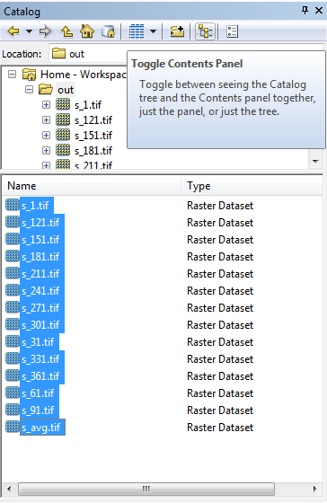

-   **Check syntax** (File \> Check or 
    button). If it completes successfully, you'll see at the status bar
    at the very bottom of the application window "Python and TabNanny
    successfully checked the file" and if not then "Failed to check -
    syntax error" and will move your cursor to where the first problem
    encountered.

-   **Close Arcmap** so you don't get file locks.

If the syntax checks OK, then you can **run** the whole script from
Pythonwin (File \> Run... or  button).
You'll get a prompt like this, for which you can simply accept the
defaults for now and OK.

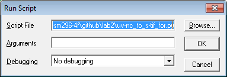

If it works correctly, you'll get output to the Interactive Window like
so:

    h:\esm296-4f\workspace\lab2\out\s_000.tif
    <string>:1: SyntaxWarning: import * only allowed at module level
    h:\esm296-4f\workspace\lab2\out\s_030.tif
    <string>:1: SyntaxWarning: import * only allowed at module level

That extra prompt about the SyntaxWarning is related to how Model
Builder exports an old tool for performing the Raster Calculator. You'll
be shown later how arcpy's Spatial Analyst module now expects to do
handle [Building complex
statements](http://resources.arcgis.com/en/help/main/10.2/index.html#/Building_complex_statements/00p60000000p000000/)
using map algebra.

<span class="octicon octicon-issue-opened"></span> Issues?: **Use Github
To Communicate**

Github is really built to communicate about code. If you have trouble
running your script and we're outside lab or office hours when you can
easily enlist our over the shoulder help, use Github to commit and push
your code onto your repository. Then you can add a comment to the lab 2
issue, like this:

    Hi @bbest,

    Can you help me understand these lines of code:

    https://github.com/bbest/esm296-4f/blob/master/lab2/uv-nc_to_s-tif.py#L17-L18

    The syntax check errors out and puts my cursor there, so something must not be right and I suspect the quotes aren't right.

You won't be able to see this URL because it's my private repo, but I
pulled it by visiting one of the Python scripts in a web browser on my
Github repo and selecting line(s) with left click (shift and click again
to select multiple lines). Notice the lines '\#L17-L18' added to the end
of the URL.


<span class="octicon octicon-info"></span> Tip: **Working with Many
Layers in ArcMap** If you have many layers in an ArcMap document, it can
easily get overwhelming. Here are a few tricks to manage that.

-   **Making just one layer visible**. You can quickly turn just one
    layer on by holding Alt + left click on the layer of interest. This
    turns off (ie unticks) the other layers.

-   **Collapse All Layers**. You can also right-click the root top of
    the contents Layers \> Collapse All Layers to reduce them to their
    smallest viewable name.

-   **Pause Drawing**. At the bottom of the map pane is a pause button,
    which frees up ArcMap for other purposes.

Add Summary Functions to Script
-------------------------------

Next, you'll add the summary functions in
`H:\esm296-4f\github\lab2\country-wind_summary.py` to the
`H:\esm296-4f\github\lab2\wind_script.py` script. The first two lines of
this country-wind\_summary (import, arcpy.CheckOutExtension) are
redundant and shouldn't be added again. You'll want to add the Local
variables above and outside the for loop, and the process scripts to the
bottom, dedented (ie aligned flush left), after and outside the for
loop.

Here's a nice Pythonic way (ie a [list
comprehension](https://docs.python.org/2/tutorial/datastructures.html#list-comprehensions))
to set a variable to being the list of all the s\_\#\_tif rasters.

from:

    s_0_tif = "H:\\esm296-4f\\workspace\\lab2\\out\\s_0.tif"
    s_120_tif = "H:\\esm296-4f\\workspace\\lab2\\out\\s_120.tif"
    s_150_tif = "H:\\esm296-4f\\workspace\\lab2\\out\\s_150.tif"
    s_180_tif = "H:\\esm296-4f\\workspace\\lab2\\out\\s_180.tif"
    s_210_tif = "H:\\esm296-4f\\workspace\\lab2\\out\\s_210.tif"
    s_240_tif = "H:\\esm296-4f\\workspace\\lab2\\out\\s_240.tif"
    s_270_tif = "H:\\esm296-4f\\workspace\\lab2\\out\\s_270.tif"
    s_30_tif = "H:\\esm296-4f\\workspace\\lab2\\out\\s_30.tif"
    s_300_tif = "H:\\esm296-4f\\workspace\\lab2\\out\\s_300.tif"
    s_330_tif = "H:\\esm296-4f\\workspace\\lab2\\out\\s_330.tif"
    s_360_tif = "H:\\esm296-4f\\workspace\\lab2\\out\\s_360.tif"
    s_60_tif = "H:\\esm296-4f\\workspace\\lab2\\out\\s_60.tif"
    s_90_tif = "H:\\esm296-4f\\workspace\\lab2\\out\\s_90.tif"

    arcpy.gp.CellStatistics_sa("H:\\esm296-4f\\workspace\\lab2\\out\\s_0.tif;H:\\esm296-4f\\workspace\\lab2\\out\\s_120.tif;H:\\esm296-4f\\workspace\\lab2\\out\\s_150.tif;H:\\esm296-4f\\workspace\\lab2\\out\\s_180.tif;H:\\esm296-4f\\workspace\\lab2\\out\\s_210.tif;H:\\esm296-4f\\workspace\\lab2\\out\\s_240.tif;H:\\esm296-4f\\workspace\\lab2\\out\\s_270.tif;H:\\esm296-4f\\workspace\\lab2\\out\\s_30.tif;H:\\esm296-4f\\workspace\\lab2\\out\\s_300.tif;H:\\esm296-4f\\workspace\\lab2\\out\\s_330.tif;H:\\esm296-4f\\workspace\\lab2\\out\\s_360.tif;H:\\esm296-4f\\workspace\\lab2\\out\\s_60.tif;H:\\esm296-4f\\workspace\\lab2\\out\\s_90.tif", s_avg_tif, "MEAN", "DATA")

to:

    s_tifs = ["h:\\esm296-4f\\workspace\\lab2\\out\\s_%03d.tif" % j for j in range(1, 365, 30)]

    arcpy.gp.CellStatistics_sa(s_tifs, s_avg_tif, "MEAN", "DATA")

Try running the first line above in the Interactive Window. Then run
`s_tifs` to show the result. Next: `type(s_tifs)`. Let's inspect the
length of the list with `len(s_tifs)`.

Notice that we're now feeding to the first argument of the [Cell
Statistics](http://resources.arcgis.com/en/help/main/10.2/index.html#//009z0000007q000000)
function a list rather than a string. This is a different format than
the original single string with paths delimited internally by
semicolons. ArcGIS functions that allow multiple inputs for a given
argument will generally accept either, but it's nicer programmatically
to be able to manipulate a list already seperated out by items. So with
a list comprehension, you're essentially running a for loop to generate
the list. Here's an equivalent (and more verbose) way to create this
list.

    s_tifs = []
    for j in range(1, 365, 30):
        s_tifs.append("h:\\esm296-4f\\workspace\\lab2\\out\\s_%03d.tif" % j)

Note that we have to "instantiate" the list (ie create an instance of
it, in this case empty) so that we can then append to it. All lists have
the append method. You can inspect which methods and properties are
available for any given object with the dir function in Python `dir([])`
and then for more on that function `help([].append)`.

Ok, repeat the Delete contents, Check syntax, Close ArcMap steps as
above before running the whole script again.

Change to EEZ data
------------------

Update the country input data to using the EEZ shapefile. You'll need to
also update the 'NAME' field to a similarly sensible field in this
shapefile.

Repeat with Delete contents, Check syntax, Close ArcMap steps as above
before running the whole script again.

Turn in Report
--------------

Produce a similar [report in
markdown](https://rawgit.com/ucsb-bren/esm296-4f/master/wk1/lab1.html#report-in-markdown)
as lab1 but now for offshore wind at
`H:\esm296-4f\github\lab2\README.md` with:

-   map by EEZ (no need to do the model builder images)
-   top 3 countries by max and mean
-   link to your final wind\_script.py script

When you commit this README use the message to close your lab 2 issue
(or visit the issue and close it seperately).

QGIS
====

We will walk (OK, run, like we were being chased by velociraptors)
through the following lessons in the [QGIS Training
Manual](http://docs.qgis.org/2.2/en/docs/training_manual/)

1.  [2. Module: The
    Interface](http://docs.qgis.org/2.2/en/docs/training_manual/introduction/index.html)
2.  [3.1. Lesson: Working with Vector
    Data](http://docs.qgis.org/2.2/en/docs/training_manual/basic_map/vector_data.html)
3.  [4.3. Lesson:
    Classification](http://docs.qgis.org/2.2/en/docs/training_manual/vector_classification/classification.html)
4.  [7.2. Lesson: Vector
    Analysis](http://docs.qgis.org/2.2/en/docs/training_manual/vector_analysis/basic_analysis.html)
5.  [8. Module:
    Rasters](http://docs.qgis.org/2.2/en/docs/training_manual/rasters/index.html)
6.  [9. Module: Completing the
    Analysis](http://docs.qgis.org/2.2/en/docs/training_manual/complete_analysis/index.html)

EXTRA
=====

We have limited time with this class to expose you to the vast world of
advanced GIS analysis. So here are some extra bits to make you aware of
what else is possible, but nothing else in this document is due for
homework.

R Script
--------

Check out the open-source cross-platform equivalent code to accomplish
this task in R in [lab2.R](lab2.R). Feel free to open it and try it out
yourself. You'll need to run the [lab2\_setup.R](lab2_setup.R) first. It
also outputs plots to an img folder. If we have time I'll gove over the
script in class.

Use Dates in Loop
-----------------

Now that we're in a proper programming environment, we can take
advantage of other modules like
[datetime](https://docs.python.org/2/library/datetime.html). (Python
comes with many [available
modules](https://docs.python.org/2/py-modindex.html), hence the term
"batteries included".) It would be best if we centered the julian day
index on the 15th of the month for each month. To accomplish this, swap
in these lines:

    yr = 2013
    for mo in range(1, 13):

        j = (datetime.date(yr, mo, 15) - datetime.date(yr, 1, 1) + datetime.timedelta(1)).days    
        s_tif = "H:\\esm296-4f\\lab1\\out\\s_%d-%02d.tif" % (yr, mo)

For those datetime functions to be available, you'll need to import the
module prior (preferably in vicinity of the other `import arcpy`
statement).

    import datetime

You can look at a cleaned up version of the script
[uv-nc\_to\_country\_monthly.py](uv-nc_to_country_monthly.py).

Create Raster Catalog for Time Slider Visualization
---------------------------------------------------

For kicks and giggles, by loading the rasters into a raster catalog, you
can use the [Time
Slider](http://resources.arcgis.com/en/help/main/10.2/index.html#//005z0000000z000000)
and [create
animations](http://resources.arcgis.com/en/help/main/10.2/index.html#/Creating_a_time_animation/000900000069000000/).


Here's the code to populate the raster catalog.

    # create raster catalog for use with Time Slider and generating an animation
    import os
    rasters = ';'.join(['H:/esm296-4f/lab1/out/s_2013-%02d.tif' % mo for mo in range(1, 13)])
    catalog = 'H:/esm296-4f/lab1/lab1.gdb/wind_catalog'
    arcpy.CreateRasterCatalog_management(os.path.dirname(catalog), os.path.basename(catalog), raster_management_type='UNMANAGED')
    arcpy.RasterToGeodatabase_conversion(rasters, catalog)
    arcpy.CalculateDefaultGridIndex_management(catalog)
    arcpy.AddField_management(catalog, 'date_beg', 'DATE')
    arcpy.AddField_management(catalog, 'date_end', 'DATE')
    code_block = """
    def get_date(s, p):
        y = int(s[2:6])
        m = int(s[7:9])
        if p == 'beg':
            return datetime.datetime(y, m, 1)
        elif p == 'end':
            if m == 12:
                return datetime.datetime(y+1, 1, 1) - datetime.timedelta(1)
            else:
                return datetime.datetime(y, m+1, 1) - datetime.timedelta(1)       
    """
    arcpy.CalculateField_management(catalog, 'date_beg', "get_date(!Name!, 'beg')", 'PYTHON_9.3', code_block)
    arcpy.CalculateField_management(catalog, 'date_end', "get_date(!Name!, 'end')", 'PYTHON_9.3', code_block)```

You'll need to [enable
time](http://resources.arcgis.com/en/help/main/10.2/index.html#//005z0000000p000000)
on this layer before being able to use the Time Slider.

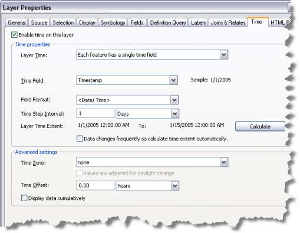

Create a Script Tool
--------------------

We started off in Model Builder and exported to a Python script. You can
further take a python script and turn it into a Script Tool to use back
in Model Builder or on its own.

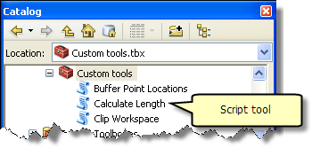

For example, find the [Multiple Ring
Buffer](http://resources.arcgis.com/en/help/main/10.2/index.html#//00080000001p000000)
tool in the Analysis toolbox. Right-click \> Edit it. You'll see that
it's actually just a Python script. Similarly, you can make your script
into a tool, allowing any of those early variables to be input as
arguments.

Here's a snippet of code to setup input arguments:

    import sys

    u_nc = sys.argv[1] # "H:\\esm296-4f\\lab1\\raw\\uwnd.sig995.2013.nc"
    v_nc = sys.argv[2] # "H:\\esm296-4f\\lab1\\raw\\vwnd.sig995.2013.nc"
    yr   = sys.argv[3] # 2013

In concept, we could make this script tool take input arguments like
above for a different year's worth of data and apply the same analysis.
This would require a fair amount of recoding so too much for this lab,
but worth sharing the idea.

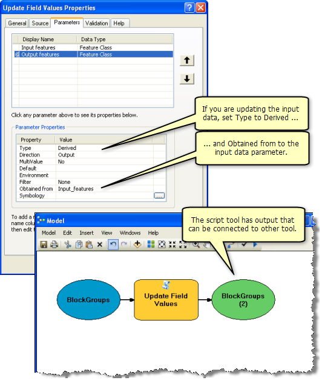

Here's more on creating Script Tools:

-   [ArcGIS Help 10.2 - A quick tour of creating tools with
    Python](http://resources.arcgis.com/en/help/main/10.2/index.html#//00150000002q000000)
-   [ArcGIS Help 10.2 - What is a script
    tool?](http://resources.arcgis.com/en/help/main/10.2/index.html#//001500000006000000)
-   [ArcGIS Help 10.2 - Adding a script
    tool](http://resources.arcgis.com/en/help/main/10.2/index.html#//00150000001r000000)
-   [ArcGIS Help 10.2 - Setting script tool
    parameters](http://resources.arcgis.com/en/help/main/10.2/index.html#//00150000000n000000)
-   [ArcGIS Help 10.2 - Debugging script
    tools](http://resources.arcgis.com/en/help/main/10.2/index.html#//00150000000m000000)
-   [ArcGIS Help 10.2 - Writing Python
    scripts](http://resources.arcgis.com/en/help/main/10.2/index.html#//002100000021000000)

Further Resources
=================

We only have time to give you the briefest of introductions to Python
and R in this course. Here are more resources for diving deeper.

Cheat sheets

-   [git](references/git_cheatsheet.pdf)
-   [Rmarkdown](https://github.com/ucsb-bren/esm296-4f/blob/master/wk1/rmarkdown_cheatsheet.pdf?raw=true)
-   [R](references/r_cheatsheet.pdf)
-   [R
    Spatial](http://www.maths.lancs.ac.uk/~rowlings/Teaching/UseR2012/cheatsheet.html)
-   [Python](references/python_cheat_sheet.pdf)

Python tutorials

-   [The Python Tutorial -
    Python.org](https://docs.python.org/2/tutorial/): authoritative,
    long document
-   [Python - CodeAcademy](http://www.codecademy.com/en/tracks/python):
    interactive 13 hr course
-   [Learn Python the Hard Way](http://learnpythonthehardway.org/book/):
    full outline of topics
-   [Software Carpentry:
    Python](http://www.software-carpentry.org/v5/novice/python/index.html)

R tutorials

-   [Try R -
    CodeSchool.com](http://tryr.codeschool.com/levels/1/challenges/3):
    interactive console
-   [Intro to R -
    DataCamp.com](https://www.datacamp.com/courses/introduction-to-r):
    interactive console. Can even customize and [create your our own
    course](https://github.com/Data-Camp/datacamp).
-   [Intro R Lecture -
    UCLA](http://www.ats.ucla.edu/stat/r/seminars/intro.htm): good
    functional overview
-   [Crash Course in R - Spatial.ly](http://spatial.ly/2013/05/crash/)

Useful Reference Sites for R

-   [Rdocumentation.org](http://Rdocumentation.org)
-   [CRAN Task Views](http://cran.r-project.org/web/views/)

ArcGIS Python Tutorials

-   [GIS Programming and Automation - Penn
    State](https://www.e-education.psu.edu/geog485/)
-   [Intro to Python for ArcGIS -
    Stanford](https://sites.google.com/site/stanfordgis2013/introduction-to-python-for-arcgis)

Open Source Python Tutorials

-   [Spatial Analysis with python -
    luxbulb.org](http://complex.luxbulb.org/howto/spatial-analysis-python)
-   [Geospatial tutorial for SciPy
    2013](https://github.com/kjordahl/SciPy2013)
-   [GDAL Tutorial - GDAL.org](http://www.gdal.org/gdal_tutorial.html)
-   [OGR Tutorial - GDAL.org](http://www.gdal.org/ogr_apitut.html)
-   [Python Spatial Analysis Library (PySAL)
    Tutorials](http://pysal.readthedocs.org/en/latest/users/tutorials/intro.html)

R Spatial Tutorials

-   [R Spatial Tips](http://spatial.ly/r/): using sp objects, ggplot2,
    ggmaps, export to KML
-   [Geospatial in
    R](http://www.maths.lancs.ac.uk/~rowlings/Teaching/UseR2012/introductionTalk.html):
    great intros and worked examples
-   [Spatial Data Analysis with R -
    URI](http://scicomp2014.edc.uri.edu/posts/2014-02-04-Hollister.html)
-   [R sp graphics example
    figures](http://rspatial.r-forge.r-project.org/gallery/)

Deeper into Scientific Python

-   [iPython: Gallery of Interesting IPython
    Notebooks](https://github.com/ipython/ipython/wiki/A-gallery-of-interesting-IPython-Notebooks)

Books on ArcGIS Python

-   [Python Scripting for
    ArcGIS](http://www.amazon.com/Python-Scripting-ArcGIS-Paul-Zandbergen/dp/1589482824)

R Markdown

-   [rmarkdown\_cheatsheet.pdf](rmarkdown_cheatsheet.pdf)
-   <https://help.github.com/articles/markdown-basics>
-   <https://guides.github.com/features/mastering-markdown/>
-   <https://stackedit.io>
