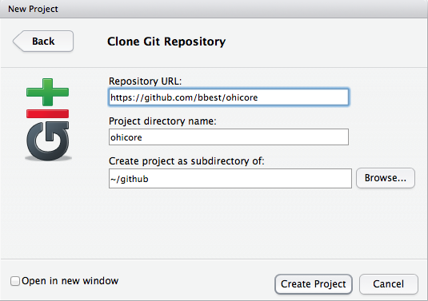

## Github Review

- Rstudio Git

Commit status:
  - ?? untracked. applies to a whole folder if has files contained.
  - A added.
  - M modified.
  - D deleted.


Once you've committed files, you'll need to push them to update your 'origin/master' aka Github repo.


## RStudio: Documenting with Markdown

* **markdown** is a plain text formatting syntax for conversion to HTML (with a tool)

* **r markdown** enables easy authoring of reproducible web reports from R

* in **rstudio**

  

## Embedding R code

**chunks**: text, tables, figures


## Embedding R code

**inline**: ``pi=`r '\x60r pi\x60'` `` evaluates to "pi=`r pi`"

## Embedding equations

**inline**

```
The Arithmetic mean is equal to $\frac{1}{n} \sum_{i=i}^{n} x_{i}$, or the summation of n numbers divided by n.
```

The Arithmetic mean is equal to $\frac{1}{n} \sum_{i=i}^{n} x_{i}$, or the summation of n numbers divided by n.

## Embedding equations (2)

**chunked**

```
$$
\frac{1}{n} \sum_{i=i}^{n} x_{i}
$$
```

$$
\frac{1}{n} \sum_{i=i}^{n} x_{i}
$$

## Online friendly

- post to **rpubs** from rstudio
  

    + this presentation
    http://rpubs.com/bdbest/rprod
  
    + more on [Authoring R Presentations](http://www.rstudio.com/ide/docs/presentations/overview)     

- post to **github**

    + natively renders markdown (*.md)
  
    + easy to see change in simple text files (vs binary / proprietary formats)

## Github in RStudio

RStudio: File > New Project > Version Control

**clone**



## Github in RStudio (2)

**commit** and **push**


## Github in RStudio (3)


## data wrangling with dplyr

* **d**plyr is the next iteration of **plyr**, focussed on tools for working with **d**ata frames.

* 

## data wrangling task

Calculate the batting average (AVG): number of base hits (H) divided by the total number of at bats (AB) using the Lahman baseball database. Limit to Babe Ruth and Jackie Robinson.

Setup

```{r, eval=F}
library(Lahman)
library(dplyr)
library(RSQLite)
```

Answer

```
  nameFirst nameLast    avg
      Babe      Ruth  0.323
    Jackie  Robinson  0.308
```

## data wrangling: sql

**sql**

```{r, eval=F}
tbl(lahman_sqlite(), sql(
"SELECT nameFirst, nameLast, 
  ROUND(AVG(H/(AB*1.0)), 3) AS avg 
FROM Batting
JOIN Master USING (playerID)
WHERE AB > 0 AND ((
  (nameFirst = 'Babe' AND 
   nameLast = 'Ruth') OR 
  (nameFirst = 'Jackie' AND 
   nameLast = 'Robinson')) 
GROUP BY nameFirst, nameLast
ORDER BY avg DESC")))
```

## data wrangling: dplyr 

**Chaining** (`%.%`): grammar of data manipulation

```{r, eval=F}
Batting %.%
  merge(Master, by='playerID') %.%
  filter(
    AB > 0 &
    (nameFirst=='Babe' & 
     nameLast =='Ruth') | 
    (nameFirst=='Jackie' & 
     nameLast =='Robinson')) %.%  
  group_by(nameFirst, nameLast) %.%
  summarise(avg = round(mean(H/AB), 3)) %.%
  arrange(desc(avg))
```