# Introduction

The United Nations has tasked you to provide a summary of offshore wind data (versus terrestrial last time). Once again they want the wind speed data summarized per country and across months of the year. They also want the results as a script to easily reproduce and fully document the parameters for this analysis.

## Learning Goals

Rather than a novel analysis, you'll work from a familiar Model Builder analysis to produce and understand a Python script. You'll only be changing the input country data (offshore EEZ vs terrestrial) to produce a different result. The point here is to provide you more time to explore the programming environment rather than novel spatial analysis.

# Data

The data is the same as last week's lab, plus the offshore Exclusive Economic Zones (EEZ).

- **NCDC.NOAA.gov: NCEP Reanalysis Wind Data** <br>
  http://www.ncdc.noaa.gov/societal-impacts/wind
    - spatial resolution: 2.5 x 2.5 degrees
    - temporal resolution: daily
    - format: netcdf (*.nc)
    - files: `H:\esm296-4f\labs\lab2\raw\uwnd.sig995.2013.nc`, `vwnd.sig995.2013.nc`
  
    
  
- **NaturalEarthData.com: 1:10m Cultural Vectors - Admin 0 – Countries** <br>
  http://www.naturalearthdata.com/downloads/10m-cultural-vectors/10m-admin-0-countries/
    - spatial resolution: 1:10m
    - version: 3.1.0
    - format: shapefile (*.shp)
    - file: `H:\esm296-4f\labs\lab2\raw\ne_10m_admin_0_countries.shp`
    
    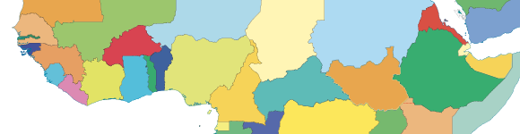

- **MarineRegions.org: Exclusive Economic Zones Boundaries (EEZ)** <br>
  http://www.marineregions.org/sources.php#eez
    - version: Low res v8 (2014-02-28, [history](http://www.marineregions.org/files/eez_v8_changes.php), [issues](http://www.marineregions.org/files/World_EEZ_v8_20140228_known_issues.txt), [methodology](http://www.marineregions.org/eezmethodology.php))
    - format: shapefile (*.shp)
    - file: `H:\esm296-4f\labs\lab2\raw\World_EEZ_v8_2014.shp`
    
    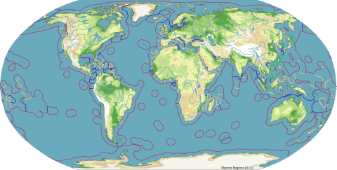

The data this week is bundled into a zip file for you, the download of which is detailed for you below  after doing some file reorganization.

# Methods

## Open RStudio (and configure git.exe path again)

In Windows Explorer, navigate to `H:\esm296-4f\github` and double-click on the github R project file to launch RStudio with that project loaded.

Unfortunately the configuration settings in Rstudio that you set in the [wk1/git](https://rawgit.com/ucsb-bren/esm296-4f/master/wk1/git.html#configure-rstudio) do not seem to transfer between machines. The only setting you really need to apply is 

RStudio menu Tools > Global Options > Git/SVN > Git executable: Browse... and paste `C:\Program Files (x86)\Git\bin\git.exe` to look like this:

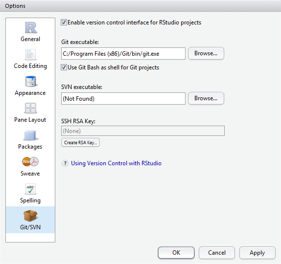

If the Git executable path wasn't already set, then you'll need to close RStudio and reopen `H:\esm296-4f\github\github.Rproj`.

<div class="alert alert-info">
<span class="octicon octicon-info"></span> Aside: **.gitignore**

You might've noticed the `.gitignore` file which RStudio automatically creates for telling git to ignore some temporary R files. Here's the contents of the default file when you create an RStudio project in a git repository.

```
.Rproj.user
.Rhistory
.RData
```

You don't want to track any of these files:

- **.Rproj.user** refers to a folder RStudio creates to store internal temporary info for your session.

- **.Rhistory** file keeps your local command history from the R console.

- **.RData** stores all your environment variables for your  session if enabled in RStudio options. 

It's a good idea to add this .gitignore file, commit and push to github so that this setting takes effect next time you might clone the repo to a different machine / path.
</div>

## Download Data

Download the prepatory lab2 files here:

  https://purl.org/net/frew/ESM296/wk2/lab2.7z

I recommend placing this in `H:\esm296-4f`, right clicking 7-Zip > Extract here.

## Inspect and Run Lab 1 Model

A single model has been created for you which replicates lab 1. Let's have a look by opening ArcMap and saving a new blank ArcMap document to `H:\esm296-4f\labs\lab2\lab2.mxd`. Once you save the document the other contents in the containing "Home" folder become readily visible in Catalog. Now open the lab2.tbx and Edit to view the `country-wind_summary_Params` model.

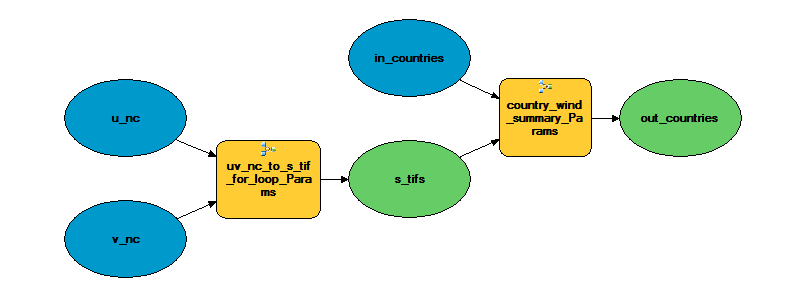

### Inspect Sub-Models

Notice how the "tools" (yellow boxes) are actually models (). You can right click > Edit these tools to open the "sub-models". We had to seperate the models because in the case of an iterator, all tools in the model are run at every iteration. Since we  want to run the summary tools just once, this model had to be seperated. The multiple outputs from the first model are gathered with the [Collect Values](http://resources.arcgis.com/en/help/main/10.2/index.html#/Examples_of_using_Model_Only_tools_in_ModelBuilder/00400000001m000000/GUID-9F197B15-27F6-46EA-BAC5-7A722C5A3C4E/). Here's an [example](http://resources.arcgis.com/en/help/main/10.2/index.html#//00400000001m000000) of iterating over rasters in a folder with a sub-model.

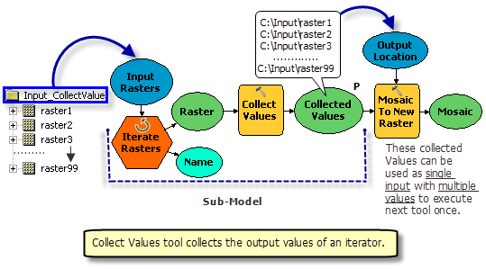

Notice also the use of [model parameters](http://resources.arcgis.com/en/help/main/10.2/index.html#//002w0000003z000000) denoted with the big **P** in the sub-models and how these get appied by the main model. You can double click a sub-model to see its parameters.

For more details on how to do this yourself, check out the [Tutorial: Creating tools with ModelBuilder](http://help.arcgis.com/en/arcgisdesktop/10.0/help/index.html#//002w0000007v000000). We want to move onto programming and not dwell further in Model Builder world, so merely introducing you to this functionality by example for now.

### Slight Differences in Model

Besides this nesting of sub-models, we've made a few minor modifications:

- Copied the raw/*countries.shp into the geodatabase with the Copy Features tool. This is preferred in principal so that your analysis is completely reproducible and therefore shouldn't modify the original raw data. Some of you may have also noticed that every time you ran the model it would join a new set of fields, not replace any existing, so the countries shapefile would end up with multiple fields (ie MEAN, MEAN_1, MEAN_12, etc). A fresh copy of countries now gets copied over to the geodatabase at the begining of the model which avoids this problem.

- For loop starts j at 0. This is because looking again at the documentation for the [Make NetCDF Raster Layer](http://resources.arcgis.com/en/help/main/10.2/index.html#//004300000006000000) you'll notice:

    <blockquote>
    BY_INDEX — The input value is matched with the position or index of a dimension value. The index is 0 based, that is, the position starts at 0.
    </blockquote>

## Export Models to Scripts

The model above gets the job done, but it is a bit convoluted with nested models and the inline variable substitution. Really, this analysis motivates writing a script since that environment is much more suited to iterating through a loop and using variables.

So you can easily export a ModelBuilder model to a python script, however models with Iterators do not work and nested models don't reveal the submodels they use. So to get started, you'll want to export from the lab2.tbx model to a Python script (Model Builder menu Model > Export > To Python Script...) the following:

- `uv-nc_to_s-tif` to `H:\esm296-4f\github\lab2\uv-nc_to_s-tif.py`

- `country-wind_summary` to `H:\esm296-4f\github\lab2\country-wind_summary.py`

We'll implement looping in the first and append to the second for a script that does it all.

## Open Script in WinPython

Take a look at the file `H:\esm296-4f\github\lab2\uv-nc_to_s-tif.py` by right clicking on it in Windows Explorer > Edit with Pythonwin.

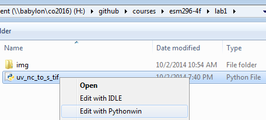

A few observations on Pythonwin:

- Two windows open: 

    1. Script editor to the file you opened, and 
  
    2. Interactive Window which is the console into which you can type Python commands. Go ahead with your first test of Python after the prompt ">>>":
  
        ```python
        1 + 1
        ```
  
        Yay, it can at least work as a simple calculator.
  
- Use menu Window > Tile to fill out the window with all open windows, and upper right window buttons to minimize / maximize / close.

## Anatomy of an Arcpy Script

Once again, the "#" character begins a comment. Note the commented names for the major sections of the Python script:

- **# Import arcpy module**

    First, the arcpy module gets imported. This module contains all the tools available in ArcGIS. Notice how it prefixes all the remaining statements besides the Local variables section. This `module.function()` notation is common amongst object oriented languages. More generally, you'll see `object.function()` or `object.property`. Functions generally have arguments that are specified within the paranthesis and seperated by commas (except a small handful of special ones like `import`).
 
- **# Check out any necessary licenses**

    In order for tools from the Spatial Analyst toolbox to run the extension needs to be checked out (equivalent to needing to tick the Spatial Analyst extension on in the ArcMap menu Customize > Extensions...).

- **# Local variables**

    Notice how variable is on the left, equal sign "=" means assignment, and value on the right. In this case all variables are strings, hence wrapped in quotes. If they were strings and didn't have quotes the values would have to either be numeric or the name of another assigned variable.

- **# Process: ***

    Here are the tools are doing the actual work. Notice the correspondence between the individual arguments set here and how you filled out the parameters of the Model Builder forms. Strings are used for all arguments except the input and output paths, which are assigned to variables. In fact any argument can be assigned a variable.

So what's the advantage of assigning a variable? It makes it easy to change in one location and use in multiple locations. If you don't expect it to change and are only using in one place then you probably don't need to assign it to a variable; if it's not going to "vary" then no need for a variable.

For every tool in ArcGIS there is a corresponding set of documentation and examples for its use in Python at the bottom of every tool's help documentation. For example, check out the documentation on the first tool [Make NetCDF Raster Layer (Multidimension)](http://resources.arcgis.com/en/help/main/10.2/index.html#//004300000006000000). The functions generally have the form CamelCaseToolName_toolboxshortname, hence "MakeNetCDFRasterLayer_md" which is part of the Multidimension toolbox ("_md").

## Intro to Python

Let's start by typing some code (not copy / paste) in the Pythonwin's Interactive Window. 

Assignment of variables is with `=` whereas testing equality is `==` which returns True or False. Try the following.

```python
1 + 1
a = 1
b = 2
a == 1
a == b
c = 'a string'
a + c
```

That last line should give you an error `TypeError: unsupported operand type(s) for +: 'int' and 'str'` since you cannot add an integer and a string. You can however convert a number to a string and add two strings together. Note that quotes can be either `"` or `'` which are functionally equivalent.

```python
str(a) + c 
str(a) + ' ' + c 
'%s %d' % (a, c)
'%s %03d' % (a, c)
```

The second two lines use [string formatting operations](https://docs.python.org/release/2.4.4/lib/typesseq-strings.html) in which the `%` character is special within a string, `%s` for string or `%d` for digit, and outside it seperates the corresponding arguments. In the last case `%03d`, you can zero-pad digits, which is a useful for enbling files to nicely sort (like julian days of our example).

Let's try importing a module.

```python
import antigravity
```

Ok, that's a little Python joke (should've launched a web browser to [xkcd.com/353](http://xkcd.com/353/)). It does point to a couple interesting aspects of Python though.

1. Dynamic Typing. This just means that Python figures out how to store the variable in memory without needing to be overly verbose as to what type of variable it is and allowing it to safely interact with other variables. (More details [here](https://wiki.python.org/moin/Why%20is%20Python%20a%20dynamic%20language%20and%20also%20a%20strongly%20typed%20language).)

2. Whitespace. In Python whitespace matters. Indentation means that the code executes within the statement (for loop, conditional if, etc) as what precedes it.

To see how whitespace matters, try typing this.

```python
for i in range(1, 13):
    print i
    
```

Be sure to hit an extra return at the end. Congratulations, you just executed a loop. Notice how the interpreter automatically indented for you and the print statement executed for every iteration of the loop. Also notice how i only goes up to 12, not 13. To see why, look at the help for this function.

```python
help(range)
range(13)
```

Python is zero index based, ie the first element is indexed by 0 (not 1). So it starts at 0 and ends one less than the end.

## Python Window in ArcMap

While Pythonwin is a decent editor, you can't simply copy/paste more than one line of code from the Editor window to the Interactive Window (although you can copy multiple lines, right-click in Interactive Window and "Execute python code from clipboard").

I tend to edit code in Winpython and run chunks of code in ArcMap's [Python window](http://resources.arcgis.com/en/help/main/10.2/index.html#//002100000017000000) (available from the main toolbar as ) which does allow copy and paste of multiple lines of code and shows you the results in ArcMap.

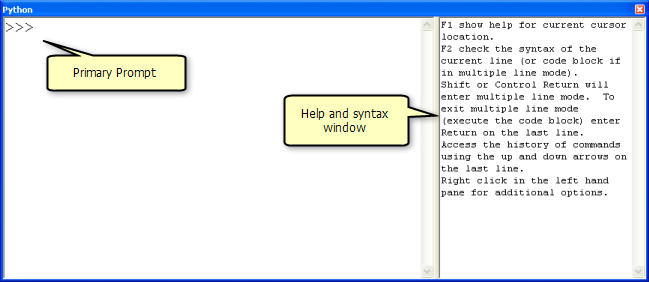

Launch the Python Window in ArcMap and try out the following mostly explained in [Using the Python window](http://resources.arcgis.com/en/help/main/10.2/index.html#//002100000018000000).

```python
# hello world
print "Hello Jack!"
count = 0
count

# assignment
x = 1
y = 2
print x + y

# a loop. note the indentation
for count in range(1,5):
  print count
```

Paths are usually defined as strings. As already mentioned in Microsoft's "infinite wisdom" decided to use a new file seperator, and instead of forward slash `/` (like everyone else) they went with the backslash `\`, reserved as the special escape character in most all other languages (eg try `print 'testing \n\t some \tbackslashing` to see newline and tab characters printed). This turns out to be a regular annoyance. Here are 3 ways to set the same file path to variable shp.

```python
shp = "H:\\esm296-4f\\labs\\lab2\\raw\\World_EEZ_v8_2014.shp"
shp = "H:/esm296-4f/labs/lab2/raw/World_EEZ_v8_2014.shp"
shp = r'H:\esm296-4f\labs\lab2\raw\World_EEZ_v8_2014.shp'
```

These all work the same when passed to a function. The last one uses the prefix `r` for raw format so doesn't interpret the escape character in a string, which makes it rather convenient to easily copy and paste from Windows Explorer or Arc Catalog address bar. Could've interchangably used single quote `'` or double quote `"` - I like the single quote since it's less bulky.

Assuming you set the variable shp, try importing the arcpy module and get a count on how many rows in this feature class.

```python
import arcpy
arcpy.GetCount_management(shp)
```

You can type a function in the ArcMap Python Window (where it will try to auto-complete for you) and on the right hand side it will provide the help documentation for that function.

<div class="alert alert-info">
<span class="octicon octicon-info"></span> Tip: **Accessing Python Snippets in Geoprocessing Results Pane**

I also find it handy to run any tool and then go into the [Geoprocessing Results](http://resources.arcgis.com/en/help/main/10.2/index.html#//002100000013000000)) pane (menu Geoprocessing > Results), right click on an executed tool and Copy As Python Snippet to get the function name and all its parameters.

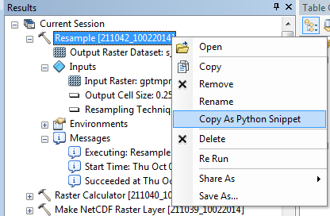

Use this trick to add the final three lines to your script. Be sure to navigate to the filesystem path of all the inputs and not use layers only temporarily available in ArcMap memory. This will make the Python snippet reusable in the future and prevent comments like this in your snippets:
</div>

## Add Loop in Pythonwin

Let's now insert a loop in the first model builder dumped script. To do so, return to Pythonwin's editor window with the file `H:\esm296-4f\github\lab2\uv-nc_to_s-tif.py` and save it (File > Save As...) to `H:\esm296-4f\github\lab2\wind_script.py`.

Let's add a loop with the same parameters as the For loop in our Model Builder model (from 0, to 365, increment 30). Every variable with a "001" suffix should use string formatting to substitute values, so needs to be moved down below the for statement. And everything to be looped needs to be indented.

Here's part of the answer, which you can copy and paste into ArcMap's command window to try out. (Should print out 13 lines with the unique filename updated having an incrementing zero padded value of j substituted.)

```python
# loop over a range of values for j
for j in range(0, 365, 30):
    
    # assign values based on variable j
    s_001_tif = "h:\\esm296-4f\\labs\\lab2\\out\\s_%03d.tif" % j
    print s_001_tif

```

You'll want to place this loop into the script after defining u and v, and before the process tools.

Go ahead with moving and updating with the same string formatting trick the rest of the variables having names ending in "\_001" (u_001, v_001, s_001, s_001_tif). 

It's very important you also use variable substitution for the index, currently `"time 1"`, so each iteration extracts a new slice of data from the netcdf. Otherwise every iteration will simply be the first month's data. You don't want zero padding in this case since it's not formatting a filename to be neatly sorted, but used as an input parameter to the tool.

You'll need to also update the formula in the Raster Calculator step from:

```python
"SquareRoot( Square(\"%u_001%\") + Square(\"%v_001%\") )"
```

to:

```python
"SquareRoot( Square('%s') + Square('%s') )" % (u_001, v_001)
```

The Model Builder syntax for inline variable substitution (wrapping the variable in percent symbols like `%u_001%`) no longer works in the Python environment, so you're using the same Python string formatting approach to update the formula with values of the u_001 and v_001, which are getting updated at every iteration j of the for loop. Note that originally to include the quote inside a quoted string, the escape character was needed. Another trick is alternating the quote character (from `"` to `'`, or vice versa) so escaping is not needed.

Since you might need to run this script more than once to debug any syntax issues or missing iterators, I recommend adding the following line to set your arcpy environment to allow overwriting output.

```python
arcpy.env.overwriteOutput = True
```

A good place for this is below the arcpy.CheckOutExtension, after import arcpy and before executing any tools where other arcpy environments are getting set.

Ok, almost ready to run. First:

- **Delete contents** from the `H:\esm296-4f\labs\lab2\out` folder so you can be assured it's generating the output.

<div class="alert alert-info">
<span class="octicon octicon-info"></span> Tip: **Selecting Multiple Items in Catalog**

You can toggle the contents panel in the Catalog window of ArcMap to enable multiple select (left-click top, shift and left-click bottom of list), which is very handy for deleting or moving many items at once.

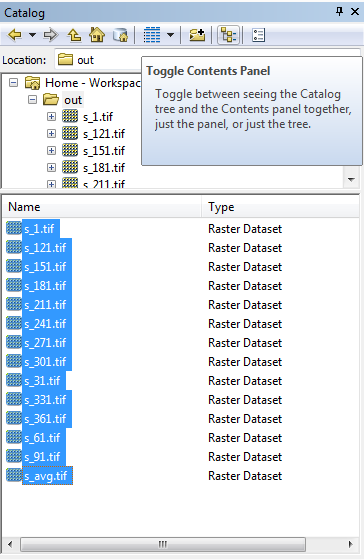
</div>

- **Check syntax** (File > Check or  button). If it completes successfully, you'll see at the status bar at the very bottom of the application window "Python and TabNanny successfully checked the file" and if not then "Failed to check - syntax error" and will move your cursor to where the first problem encountered.


- **Close Arcmap** so you don't get file locks.

If the syntax checks OK, then you can **run** the whole script from Pythonwin (File > Run... or 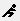 button). You'll get a prompt like this, for which you can simply accept the defaults for now and OK.

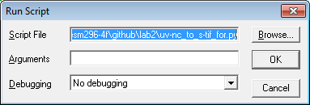

If it works correctly, you'll get output to the Interactive Window like so:

```
h:\esm296-4f\labs\lab2\out\s_000.tif
<string>:1: SyntaxWarning: import * only allowed at module level
h:\esm296-4f\labs\lab2\out\s_030.tif
<string>:1: SyntaxWarning: import * only allowed at module level
```

That extra prompt about the SyntaxWarning is related to how Model Builder exports an old tool for performing the Raster Calculator. You'll be shown later how arcpy's Spatial Analyst module now expects to do handle [Building complex statements](http://resources.arcgis.com/en/help/main/10.2/index.html#/Building_complex_statements/00p60000000p000000/) using map algebra.

<div class="alert alert-warning">
<span class="octicon octicon-issue-opened"></span> Issues?: **Use Github To Communicate**

Github is really built to communicate about code. If you have trouble running your script and we're outside lab or office hours when you can easily enlist our over the shoulder help, use Github to commit and push your code onto your repository. Then you can add a comment to the lab 2 issue, like this:

```markdown
Hi @bbest,

Can you help me understand these lines of code:

https://github.com/bbest/esm296-4f/blob/master/lab2/uv-nc_to_s-tif.py#L17-L18

The syntax check errors out and puts my cursor there, so something must not be right and I suspect the quotes aren't right.
```

You won't be able to see this URL because it's my private repo, but I pulled it by visiting one of the Python scripts in a web browser on my Github repo and selecting line(s) with left click (shift and click again to select multiple lines). Notice the lines '#L17-L18' added to the end of the URL.

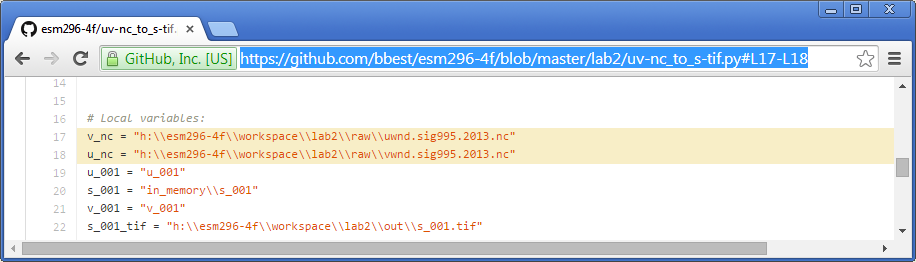
</div>
    
<div class="alert alert-info">
<span class="octicon octicon-info"></span> Tip: **Working with Many Layers in ArcMap**
If you have many layers in an ArcMap document, it can easily get overwhelming. Here are a few tricks to manage that.

- **Making just one layer visible**. You can quickly turn just one layer on by holding Alt + left click on the layer of interest. This turns off (ie unticks) the other layers.

- **Collapse All Layers**. You can also right-click the root top of the contents Layers > Collapse All Layers to reduce them to their smallest viewable name.

- **Pause Drawing**. At the bottom of the map pane is a pause button, which frees up ArcMap for other purposes.
</div>

## Add Summary Functions to Script

Next, you'll add the summary functions in `H:\esm296-4f\github\lab2\country-wind_summary.py` to the `H:\esm296-4f\github\lab2\wind_script.py` script. The first two lines of this country-wind_summary (import,  arcpy.CheckOutExtension) are redundant and shouldn't be added again. You'll want to add the Local variables above and outside the for loop, and the process scripts to the bottom, dedented (ie aligned flush left), after and outside the for loop.

Here's a nice Pythonic way (ie a [list comprehension](https://docs.python.org/2/tutorial/datastructures.html#list-comprehensions)) to set a variable to being the list of all the s_#_tif rasters.

from:

```python
s_0_tif = "H:\\esm296-4f\\labs\\lab2\\out\\s_0.tif"
s_120_tif = "H:\\esm296-4f\\labs\\lab2\\out\\s_120.tif"
s_150_tif = "H:\\esm296-4f\\labs\\lab2\\out\\s_150.tif"
s_180_tif = "H:\\esm296-4f\\labs\\lab2\\out\\s_180.tif"
s_210_tif = "H:\\esm296-4f\\labs\\lab2\\out\\s_210.tif"
s_240_tif = "H:\\esm296-4f\\labs\\lab2\\out\\s_240.tif"
s_270_tif = "H:\\esm296-4f\\labs\\lab2\\out\\s_270.tif"
s_30_tif = "H:\\esm296-4f\\labs\\lab2\\out\\s_30.tif"
s_300_tif = "H:\\esm296-4f\\labs\\lab2\\out\\s_300.tif"
s_330_tif = "H:\\esm296-4f\\labs\\lab2\\out\\s_330.tif"
s_360_tif = "H:\\esm296-4f\\labs\\lab2\\out\\s_360.tif"
s_60_tif = "H:\\esm296-4f\\labs\\lab2\\out\\s_60.tif"
s_90_tif = "H:\\esm296-4f\\labs\\lab2\\out\\s_90.tif"

arcpy.gp.CellStatistics_sa("H:\\esm296-4f\\labs\\lab2\\out\\s_0.tif;H:\\esm296-4f\\labs\\lab2\\out\\s_120.tif;H:\\esm296-4f\\labs\\lab2\\out\\s_150.tif;H:\\esm296-4f\\labs\\lab2\\out\\s_180.tif;H:\\esm296-4f\\labs\\lab2\\out\\s_210.tif;H:\\esm296-4f\\labs\\lab2\\out\\s_240.tif;H:\\esm296-4f\\labs\\lab2\\out\\s_270.tif;H:\\esm296-4f\\labs\\lab2\\out\\s_30.tif;H:\\esm296-4f\\labs\\lab2\\out\\s_300.tif;H:\\esm296-4f\\labs\\lab2\\out\\s_330.tif;H:\\esm296-4f\\labs\\lab2\\out\\s_360.tif;H:\\esm296-4f\\labs\\lab2\\out\\s_60.tif;H:\\esm296-4f\\labs\\lab2\\out\\s_90.tif", s_avg_tif, "MEAN", "DATA")
```

to:

```python
s_tifs = ["h:\\esm296-4f\\labs\\lab2\\out\\s_%03d.tif" % j for j in range(1, 365, 30)]

arcpy.gp.CellStatistics_sa(s_tifs, s_avg_tif, "MEAN", "DATA")
```

Try running the first line above in the Interactive Window. Then run `s_tifs` to show the result. Next: `type(s_tifs)`. Let's inspect the length of the list with `len(s_tifs)`.

Notice that we're now feeding to the first argument of the [Cell Statistics](http://resources.arcgis.com/en/help/main/10.2/index.html#//009z0000007q000000) function a list rather than a string. This is a different format than the original single string with paths delimited internally by semicolons. ArcGIS functions that allow multiple inputs for a given argument will generally accept either, but it's nicer programmatically to be able to manipulate a list already seperated out by items. So with a list comprehension, you're essentially running a for loop to generate the list. Here's an equivalent (and more verbose) way to create this list.

```python
s_tifs = []
for j in range(1, 365, 30):
    s_tifs.append("h:\\esm296-4f\\labs\\lab2\\out\\s_%03d.tif" % j)
```
    
Note that we have to "instantiate" the list (ie create an instance of it, in this case empty) so that we can then append to it. All lists have the append method. You can inspect which methods and properties are available for any given object with the dir function in Python `dir([])` and then for more on that function `help([].append)`.

Ok, repeat the Delete contents, Check syntax, Close ArcMap steps as above before running the whole script again.

## Change to EEZ data

Update the country input data to using the EEZ shapefile. You'll need to also update the 'NAME' field to a similarly sensible field in this shapefile.

Repeat with Delete contents, Check syntax, Close ArcMap steps as above before running the whole script again.

## Turn in Report

Produce a similar [report in markdown](https://rawgit.com/ucsb-bren/esm296-4f/master/wk1/lab1.html#report-in-markdown) as lab1 but now for offshore wind at `H:\esm296-4f\github\lab2\README.md` with:

- map by EEZ (no need to do the model builder images)
- top 3 countries by max and mean
- link to your final wind_script.py script

When you commit this README use the message to close your lab 2 issue (or visit the issue and close it seperately).

# QGIS

We will walk (OK, run, like we were being chased by velociraptors) through the following lessons in the [QGIS Training Manual](http://docs.qgis.org/2.2/en/docs/training_manual/)

1. [2. Module: The Interface](http://docs.qgis.org/2.2/en/docs/training_manual/introduction/index.html)
1. [3.1. Lesson: Working with Vector Data](http://docs.qgis.org/2.2/en/docs/training_manual/basic_map/vector_data.html)
1. [4.3. Lesson: Classification](http://docs.qgis.org/2.2/en/docs/training_manual/vector_classification/classification.html)
1. [7.2. Lesson: Vector Analysis](http://docs.qgis.org/2.2/en/docs/training_manual/vector_analysis/basic_analysis.html)
1. [8. Module: Rasters](http://docs.qgis.org/2.2/en/docs/training_manual/rasters/index.html)
1. [9. Module: Completing the Analysis](http://docs.qgis.org/2.2/en/docs/training_manual/complete_analysis/index.html)
