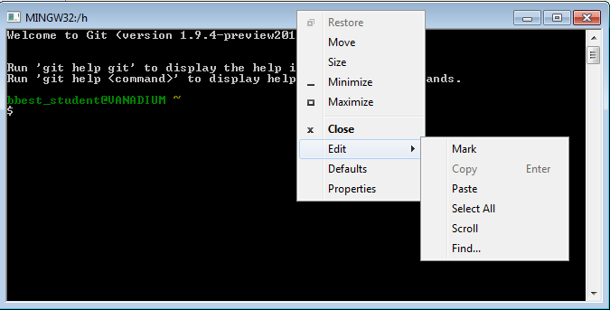

# Reorganize Filesystem

The organization of files for this class currently looks like this:

- **`H:\github\esm296-4f`** <br>
  read-only repo for course
  
- **`H:\github\courses\esm296-4f`** <br>
  read-write personal courses repo containing esm296-4f folder
  
- **`H:\esm296-4f`** <br>
  personal labs for working through labs and everything else, especially for big data files

This system is confusing, understandably. Don't do anything just yet, but we're going to move things around to look like this:

- **`H:\esm296-4f\instruction`** <br>
  downloaded instruction for course
  
- **`H:\esm296-4f\github`** <br>
  your read-write personal repo for the course
  
- **`H:\esm296-4f\labs`** <br>
  personal labs for working through labs and everything else, especially for big data files

So all folders will sensibly be contained within `H:\esm296-4f`: instruction, github, labs. You'll notice that we're no longer suggesting you maintain two different Github repositories, one for course instruction and one for yourself. Instead, you need to only maintain your read-write course repository, now simply called github. For the course instruction, it's best to navigate from http://tinyurl.com/ESM296 where you'll find the latest linked content. If you wish to download files for archival purposes, feel free to place them in the instruction folder.

We'll use Git Bash commands to accomplish this. Except where needing to make substitutions, please copy from this lab document and paste into the Git Bash command line window to ensure we have the same paths.

<div class="alert alert-info">
<span class="octicon octicon-info"></span> Tip: **Copy & Paste in Git Bash**

There are two ways to copy and paste in Git Bash. You can right-click the top bar to access the menu.



To copy and paste, you can either:

1. Use the Edit menu. To copy, you first set the mode to Edit > Mark and then left click and hold to select the text, and return to enter it into the clipboard. To paste, Edit > Paste.

2. Use the Quick Edit shortcuts. Tick on Quick Edit from the Default menu. Then you don't need to use the menu. To copy, simply left-click and hold to select text and return to enter it into the clipboard. To paste, simply right-click into the window.
</div>

Let's start by moving the labs contents of `H:/esm296-4f/` to `H:/esm296-4f/labs/`. (NOTE: We're switching the file path seperator from Windows backslash `\` to the Linux / Mac / rest of the world forwardslash `/`. Also, lines beginning with `#` are explanatory comments and ignored by the Git Bash command line.)

```bash
# change directory to home, ie /h or ~
cd /h

# make labs directory
mkdir esm296-4f/labs

# look at help for the move command, noting sequence of SOURCE DESTINATION arguments 
mv --help

# move lab1 into labs
mv esm296-4f/lab1 esm296-4f/labs/lab1

# list files and folders
ls esm296-4f
```

You should only see "labs" in the output of the last command listing the contents of the `H:\esm296-4f` folder. If you have other files or folders, please move them to the new `H:\esm296-4f\labs` folder using the mv command similar to above, swapping out lab1 for the name of the file or folder.

Next, let's move the course instruction `H:\github\esm296-4f` to `H:\esm296-4f\instruction`.

```bash
mv /h/github/esm296-4f /h/esm296-4f/instruction
```

Finally, we want to move `H:\github\courses\esm296-4f` to `H:\esm296-4f\github`. This is trickier. Ideally, you could simply git clone/commit/push just the esm296-4f subfolder of your courses Github repository. That turns out to be quite complicated to do and not recommended. So instead, we'll just have you move the content of the esm296-4f subfolder up a level, and move that to the new path. Since you'll be moving content tracked by git, we want to now use "git mv" (not just "mv") so these changes are tracked before executing a git commit and git push to update the online Github repo.

```bash
# change into the courses repo so the git commands know to register with that repo
cd /h/github/courses

# move the contents of git mv esm296-4f/*  into this root folder of the repo
git mv esm296-4f/* .

# remove this now empty directory esm296-4f
rmdir esm296-4f

# rename the Rproj file to match the containing folder
git mv courses.Rproj github.Rproj

# git status should show a bunch of files being renamed
git status

# commit the changes with a message
git commit -m "reorganize courses repo to being dedicated to esm296-4f"

# push changes to your github repo
git push

# change out of this directory so we can move it to the new path
cd ~

# move github/courses to esm296-4f/github
mv github/courses esm296-4f/github
```

Now you should have a more sane set of folders all contained within `H:\esm296-4f\` as described above: github, instruction and labs.

# Rename courses to esm296-4f, make private, add name

You should rename your courses repo on Github since that more accurately reflects this repo now being dedicated to just this course. While you're in the settings area, you'll make the repo private. You should've all recieved your educational discount by now (Please let us know if not).

Start by visiting your repository (swap USER with your own Github username):

https://github.com/USER/courses

If you aren't signed in to github.com and your repository is already private, you'll get a 404 not found error. Just visit github.com and sign in, if needed.

1. Rename repo. Visit your repository **Settings** <span class="octicon octicon-tools"></span> in the right hand navigation pane for the repository and change Repository name from "courses" to "esm296-4f".

1. Make repo private. Return to the **Settings** <span class="octicon octicon-tools"></span>, go to the "Danger Zone", and click "Make private". You'll have to enter "courses" as the repository name to confirm you really want to do this. You do -- you're fearless like that in the danger zone!

1. Add your name to user profile. Now visit your user settings <span class="octicon octicon-gear"></span> in upper right. Under Profile, be sure to include your First Last in Name (so we can match you to your Github username).

Github will still redirect from your old "courses"" repo to the renamed "esm296-4f". It's good practice to tell git the proper remote URL (or you'll get a minor warning). So let's replace the URL in the git configuration with the Git Bash sed ("stream editor") command.

```bash
cd /h/esm296-4f/github
sed -i.bak s/courses/esm296-4f/g .git/config
```
